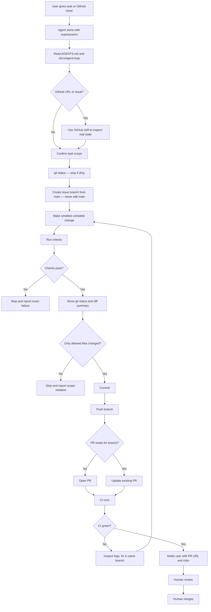

# Bemoat Web Starter

[](https://deploy.workers.cloudflare.com/?url=https://github.com/boat1994/bemoat-web-starter)

A reusable Payload 3, Next.js, and Cloudflare starter for Bemoat projects.

This starter is based on the Payload Cloudflare D1 template and extended with reusable CMS and frontend modules.

## What is included

- Payload 3 CMS
- Next.js app router frontend
- Cloudflare Workers deployment through OpenNext
- Cloudflare D1 database binding
- Cloudflare R2 media storage binding
- Generic project CMS schema
- Blog CMS schema
- Custom order page global
- Site settings global
- Thai and English localization
- One-command boilerplate sync for child projects
- VS Code and Cursor workspace defaults
- Payload CMS agent rules and Superpowers workflow guidance

## Source history

The first Bemoat boilerplate layer was extracted from working project code and cleaned up for reuse in new repositories.

## Agent and editor setup

This starter includes the same development guidance used in the source project:

- `AGENTS.md` for repository-wide Payload CMS development rules
- `.cursor/rules/*` for Cursor rules covering Payload collections, fields, hooks, access control, endpoints, adapters, plugins, custom components, and critical security patterns
- `.cursor/rules/superpowers-using-superpowers.mdc` to require the Superpowers skill workflow
- `.vscode/*` for recommended extensions, formatting, TypeScript SDK, and Next.js debugging

All coding agents should begin task work with:

```text
superpowers:using-superpowers
```

Skill source:

```text
/home/boat/.codex/plugins/cache/openai-curated/superpowers/c6ea566d/skills/using-superpowers/SKILL.md
```

Before responding, asking clarifying questions, planning, editing files, running implementation commands, or reviewing code, agents should check whether a skill applies and follow it first. User instructions remain the highest priority.

## Development workflow

Short task prompts are enough for agents working in this repository. The operating rules live in [AGENTS.md](./AGENTS.md), the step-by-step loop is in [docs/agent-loop](./docs/agent-loop/README.md), the [issue-driven branch workflow](./docs/agent-loop/issue-driven-branch-workflow.md) (dedicated issue branch, dirty-tree stop, no edits on `main`, PR open/update), the [starter knowledge base](./docs/knowledge/README.md) collects short operational notes (scripts, sync, guards, common failures), [production hardening](./docs/hardening.md) indexes release tags, drift check, smoke test, secrets, and branch protection, [security and migration guardrails](./docs/agent-loop/security-and-migrations.md) define stop conditions for secrets and production deploy; [migration draft PR workflow](./docs/agent-loop/migration-draft-pr.md) allows agents to open draft PRs for D1/Payload migrations after checks pass, [schema evolution](./docs/schema-evolution.md) defines additive-first Payload changes for production data, GitHub issue and PR templates capture task scope, and CI validates every pull request.

**Issue-based work:** run `git status` first, never modify `main` directly, use branch naming `<type>/<issue-number>-<short-slug>`, stop on a dirty working tree, and open or update a PR when development is complete. Paste-ready prompt: [composer-issue-workflow-prompt.md](./docs/agent-loop/composer-issue-workflow-prompt.md).



## Production schema evolution

Payload schema changes that touch production CMS data must be **additive-first**: add new fields or collections instead of renaming, retyping, or retargeting existing fields in place. Mark superseded fields as **deprecated** in Payload admin (`admin.description`, optionally `readOnly` or `hidden`). Remove old fields only after a production D1 backup, human approval, and at least one stable release.

Full policy, examples, and checklist: [docs/schema-evolution.md](./docs/schema-evolution.md).

**Mantra:** Additive first. Backfill second. Switch reads third. Deprecate old fields fourth. Delete last, only with backup and explicit approval.

### Optional local git hooks

Install pre-push checks locally (**not required**; CI validates every pull request):

```bash
pnpm run hooks:install
```

Pre-push runs a **fast child-safe subset** only: `bemoat:guard:safety`, `bemoat:test:int`.

It intentionally **does not** run `typecheck`, `lint`, or `build` — child projects add those scripts when they are ready for stricter local validation.

| When | Command |
|------|---------|
| Docs/markdown/CI only (starter / child with scripts) | `pnpm run guard:safety` or `pnpm run bemoat:guard:safety` |
| Code changes before commit/PR (when scripts exist) | `pnpm run check` (**required** in starter, lint must have **zero warnings**) |
| Before merge (human, when scripts exist) | `pnpm run check:full` when practical |
| Every PR on GitHub (synced child CI) | `bemoat:guard:safety` + `bemoat:test:int` only |
| Starter repo on GitHub | child-safe CI plus [starter strict workflow](./.github/workflows/ci-starter.yml) |
| Optional before push | pre-push hook subset (`bemoat:*` only) |

### Child harness script contract

Synced harness automation (`.github/workflows/ci.yml`, `.githooks/pre-push`) calls **only `bemoat:*` scripts**. Child projects should treat `bemoat:*` as the public harness API:

| Script | When to use |
|--------|-------------|
| `bemoat:guard:safety` | Every PR (CI) and optional pre-push — repo safety + harness contract |
| `bemoat:test:int` | Every PR (CI) and optional pre-push — shared integration tests |
| `bemoat:guard:cloudflare-env` | Before deploy/preview when those scripts exist |
| `bemoat:check` | Optional stricter validation when child defines `lint` and `typecheck` |
| `bemoat:boilerplate:sync` / `bemoat:boilerplate:check` | Pull harness updates from starter |
| `bemoat:hooks:install` | Install optional local pre-push hook |

Raw scripts (`lint`, `typecheck`, `build`, `deploy`, `preview`, `check`, `guard:safety`, etc.) are starter-internal or child-local. Do not wire them into synced CI or pre-push. Full contract: [docs/harness-sync-contract.md](./docs/harness-sync-contract.md).

This template is expected to run on Cloudflare Paid Workers because the bundle can exceed the free Worker size limit.

Do not copy one project's Cloudflare resources into another project without changing them first:

- D1 database ID
- D1 database name
- R2 bucket name
- Worker name
- Environment variables
- Secrets

## Cloudflare deploy button settings

When Cloudflare asks for commands, use pnpm:

```text
Build command: pnpm run build
Deploy command: pnpm run deploy
```

The npm scripts internally use `pnpm exec` for OpenNext, Payload, and Wrangler so the local project binaries are used consistently.

## Local setup

```bash
pnpm install
pnpm wrangler login
pnpm dev
```

## Generate Payload files

Run these after changing Payload collections, globals, admin fields, or import map components:

```bash
pnpm run generate:importmap
pnpm run generate:types
```

## Create migrations

Run this before deploying schema changes to Cloudflare D1:

```bash
pnpm payload migrate:create
```

Review the generated migration before running deploy.

## Deploy

You can start from the Cloudflare deploy button at the top of this README, or deploy manually after setting up your Cloudflare resources.

```bash
pnpm run deploy
```

The deploy command runs Payload migrations against the remote D1 binding, optimizes remote D1, builds the app, and deploys the Worker.

After deploy, run the [deploy smoke test checklist](./docs/deploy-smoke-test.md) to confirm frontend, admin, Payload, D1, R2, and Cloudflare routing.

## Cloudflare environments (production vs dev)

Bemoat projects use **two deploy targets**. Full guide (synced to child projects): **[docs/cloudflare-environments.md](./docs/cloudflare-environments.md)**.

| Target | Command | Config |
| --- | --- | --- |
| **Production** (main branch, Cloudflare auto-deploy) | `pnpm run deploy` | Top-level `wrangler.jsonc` — **no** `--env` |
| **Dev** (local only, isolated Worker/D1/R2) | `pnpm run deploy:dev` | `wrangler.jsonc` → `env.dev` |

**Rules that prevent confusion:**

- Production does **not** use `env.production` or `CLOUDFLARE_ENV=production`.
- Dev is explicit: `deploy:dev` sets `CLOUDFLARE_ENV=dev` and passes `--env=dev`.
- Never point `env.dev` at production D1 or R2 — create separate dev resources in Cloudflare first.
- `pnpm run deploy` and `pnpm run preview` run `guard:cloudflare-env` first (blocks `CLOUDFLARE_ENV=production` and duplicate dev bindings).
- `wrangler.jsonc` is **project-specific** and is not overwritten by boilerplate sync; copy the `env.dev` pattern from the starter into your child project and fill in your dev D1 ID and bucket names.

```bash
# Production (live site)
pnpm run deploy

# Dev stack from your laptop (after env.dev is configured)
pnpm run deploy:dev
```

## Recommended project flow (deploy-first)

Real Bemoat projects should **not** start by cloning this repository directly. Use the deploy-first path:

1. Click **[Deploy to Cloudflare](https://deploy.workers.cloudflare.com/?url=https://github.com/boat1994/bemoat-web-starter)** at the top of this README.
2. Let Cloudflare create or connect the project and provision Worker, D1, R2, and secrets for that deployment.
3. Clone the **generated child project** repository locally (the repo Cloudflare creates or connects—not this starter).
4. Run local setup:

```bash
pnpm install
pnpm run generate:importmap
pnpm run generate:types
pnpm payload migrate:create
pnpm dev
```

5. Review any new migration, test locally, then deploy with `pnpm run deploy`.

After the project is real, configure project-specific values in the child repo:

- `package.json` name
- `wrangler.jsonc` Worker name
- D1 database config
- R2 bucket config
- Site metadata
- Domain and environment variables
- Agent rules that are no longer relevant to the child project

For the full agent operating loop, see [docs/agent-loop/README.md](./docs/agent-loop/README.md).

## Developing this starter

Clone this repository **only** when improving `bemoat-web-starter` itself (shared collections, starter pages, CI, agent docs, sync script):

```bash
git clone https://github.com/boat1994/bemoat-web-starter.git
cd bemoat-web-starter
pnpm install
pnpm dev
```

Do not use this clone-first path to start a customer or product repository.

## Boilerplate sync command

**Existing child projects** can pull the latest reusable boilerplate layer from this starter with one command. Sync is for **updating** projects that already exist after deploy—not the primary way to create a new project.

For **release tags, changelog policy, and when to sync from `main` vs a stable tag**, see [docs/releases.md](./docs/releases.md).

## Adopt harness in an existing project

Use this workflow when an **existing Bemoat repository** already has its own Payload schema, frontend routes, components, hooks, access rules, lib utilities, and `payload.config.ts`. These projects should adopt **harness rails only** — not starter application modules.

For the canonical agent loop (branch gates, validation, PR, report), see [docs/agent-loop/harness-sync-workflow.md](./docs/agent-loop/harness-sync-workflow.md).

**Harness-only sync brings in:**

- Shared agent rules (`AGENTS.md`, `.cursor/rules`)
- GitHub CI workflow and templates
- Safety guards (`guard-repo-safety`, `guard-cloudflare-env`)
- Agent-loop and hardening docs
- Sync and drift scripts, optional git hooks
- Vitest harness and shared integration tests under `tests/int/`

**Harness-only sync does not bring in:**

- Payload starter collections, globals, hooks, or access helpers
- Frontend starter pages under `src/app/(frontend)`
- Starter components, lib utilities, or `src/payload.config.ts`

`package.json` remains **child-owned**. Sync may add **missing `bemoat:*` scripts only**; it never overwrites existing `bemoat:*` scripts, never touches deploy/build/check/test scripts, and never touches `dependencies` or `devDependencies`. All other package differences appear in **`.bemoat/package-sync-proposal.md`** as human-review-only information (included in the sync commit).

```bash
git checkout main
git pull
git checkout -b chore/adopt-bemoat-harness

pnpm run boilerplate:check -- --harness-only
pnpm run boilerplate:sync -- --harness-only
```

After sync:

1. Review **`.bemoat/package-sync-proposal.md`** for script and dependency drift (human review only). Do not apply automatically — update `package.json` manually when desired.
2. Run **`pnpm install`** if you changed dependencies.
3. Run **`pnpm run check`** to verify harness rails locally.
4. Commit, push, and open a PR for human review.

Use **`--full`** only for **new** child projects that intentionally want missing starter modules copied once. See [docs/boilerplate-sync-command.md](./docs/boilerplate-sync-command.md) and [docs/harness-sync-contract.md](./docs/harness-sync-contract.md).

Before syncing, check which rails-managed boilerplate files differ from the starter. Use **`harness-only`** for existing projects; use **`full`** only when you also want to see missing starter seed files.

```bash
# Existing projects (default)
pnpm run boilerplate:check -- --harness-only

# New projects that may still import missing starter modules
pnpm run boilerplate:check -- --full
```

In **`bemoat-web-starter` itself** (the source repository), this command exits successfully with a skip message — it is intended for **child projects** comparing against upstream boilerplate. Starter development should use git diff and CI instead.

The check reports managed drift (must sync), missing seed files (**`full` mode only**), customized seed files (ignored), merge-keep drift for `.gitignore`, and an informational package sync proposal when scripts or dependencies differ. `package.json` is child-owned; sync never auto-overwrites deploy, build, check, test, or dependency entries. When managed drift or missing seed files are reported, apply updates with:

```bash
# Existing projects (recommended)
pnpm run boilerplate:sync -- --harness-only

# New projects that want starter module seeding
pnpm run boilerplate:sync -- --full
```

By default, check and sync use:

```text
boat1994/bemoat-web-starter#main
```

For safer production updates, pin a version tag instead:

```bash
BEMOAT_BOILERPLATE_REF=v0.3.0-sync-rails pnpm run boilerplate:sync -- --harness-only
```

## Sync from another branch

```bash
BEMOAT_BOILERPLATE_REF=dev pnpm run boilerplate:sync -- --harness-only
```

## Sync from another repository

```bash
BEMOAT_BOILERPLATE_REPO=boat1994/bemoat-web-starter pnpm run boilerplate:sync -- --harness-only
```

## Sync modes

| Mode | Use when | Starter modules |
|------|----------|-----------------|
| **`harness-only`** (default) | Existing Bemoat projects with custom schema, frontend, and app code | Skipped — does not copy `src/collections`, `src/globals`, `src/app/(frontend)`, `src/components`, `src/hooks`, `src/access`, `src/lib`, or `src/payload.config.ts` |
| **`full`** | New child projects or repos that still want missing starter files imported once | Copied only when missing; never overwrites existing child files |

Starter modules are not harness. `package.json` remains child-owned in both modes.

## What boilerplate sync updates

### Always synced rails

These paths are source-of-truth and **may be overwritten** on every sync:

- `AGENTS.md` repository agent instructions
- `.cursor/rules/*` workflow instructions and Cursor rule files
- `.github/workflows/ci.yml` shared child-safe CI workflow (`bemoat:guard:safety`, `bemoat:test:int` only)
- `.github/pull_request_template.md` PR template
- `.github/ISSUE_TEMPLATE/agent-task.yml` agent task issue template
- `docs/agent-loop/*` agent operating loop docs
- `docs/hardening.md`, `docs/releases.md`, `docs/deploy-smoke-test.md`, `docs/cloudflare-environments.md`
- `docs/schema-evolution.md` production-safe Payload schema evolution guide
- `scripts/sync-boilerplate.mjs`, `scripts/check-boilerplate-drift.mjs`, `scripts/deploy-smoke-test.mjs`
- `scripts/guard-repo-safety.mjs`, `scripts/guard-harness-contract.mjs`, `scripts/guard-cloudflare-env.mjs`, `scripts/install-git-hooks.mjs` repository safety guards and optional git hooks
- `.githooks/pre-push` optional local pre-push harness (install with `pnpm run hooks:install`)
- `vitest.config.mts`, `vitest.setup.ts`, and shared harness integration tests under `tests/int/` (`api`, `repo-safety-guard`, `cloudflare-env-guard`, `boilerplate-sync`, `harness-contract-guard`, `open-next-config`)
- `docs/dev-boilerplate.md`, `docs/boilerplate-sync-command.md`, `docs/harness-sync-contract.md` boilerplate module and sync contract notes

### Package sync proposal (child-owned `package.json`)

`package.json` is **child-owned** and is not treated as a managed rails file. Sync:

- adds **missing `bemoat:*` scripts only** (never overwrites existing `bemoat:*` entries)
- never adds, overwrites, removes, renames, or reorders deploy/build/check/test scripts (`build`, `deploy`, `deploy:app`, `deploy:database`, `deploy:dev`, `preview`, `check`, `check:full`, `lint`, `typecheck`, `test`, `test:int`, `dev`, `start`, or any other non-namespaced script) unless the human explicitly opts into the build/deploy contract with `--apply-build-contract`
- never auto-adds, removes, bumps, or rewrites `dependencies` or `devDependencies`
- writes **`.bemoat/package-sync-proposal.md`** with script and dependency drift for human review only

Managed namespaced scripts (added when missing): `bemoat:guard:safety`, `bemoat:guard:harness-contract`, `bemoat:guard:cloudflare-env`, `bemoat:test:int`, `bemoat:check`, `bemoat:boilerplate:sync`, `bemoat:boilerplate:check`, `bemoat:hooks:install`

Non-namespaced script and dependency differences appear in the proposal under **Script drift report (human review only)** and **Dependency drift report (human review only)**. Synced CI and optional pre-push hooks assume only `bemoat:*` scripts exist — full `lint`, `typecheck`, `build`, and `check` baselines are follow-up work in each child project.

`pnpm-lock.yaml` is **not** synced. Review the package sync proposal manually before changing `package.json` or running `pnpm install`.

### Merge-keep paths

These paths keep existing child content and append missing starter entries during sync:

- `.gitignore` — child ignore rules are preserved; missing starter rules (such as `.bemoat-check-tmp/` and `.bemoat-sync-tmp/`) are appended under a `# Added by bemoat boilerplate sync` section

### Seeded-once starter files (`full` mode only)

These paths are processed only with **`pnpm run boilerplate:sync -- --full`**. Default **`harness-only`** sync skips them.

These paths are copied **only when missing** in the child project. After the child customizes them, sync **never overwrites** them:

- `src/app/(frontend)/*` starter pages (home, projects, blog, custom order, etc.)
- `src/components/*` shared UI and admin extension placeholders
- `src/collections/*`, `src/globals/*`, `src/hooks/*`, `src/access/*`
- `src/lib/*` shared utilities
- `src/payload.config.ts`

Frontend pages, collections, globals, components, and product UI are safe to customize in child projects after initial import. If a reusable improvement is needed across projects, upstream it to the starter and manually port it—or add a new seed file path.

`src/app/(payload)/*` is Payload admin framework integration and is not part of boilerplate sync.

## What boilerplate sync does not update

The sync script intentionally does not overwrite project-specific infrastructure or content:

- `wrangler.jsonc` (deploy script **recommendations** are proposed; Cloudflare **config** is not synced)
- `package.json` non-namespaced scripts and dependencies (review `.bemoat/package-sync-proposal.md` for drift; never auto-applied)
- D1 database IDs
- R2 bucket names
- Worker names
- `.env` files
- Cloudflare secrets
- Root `README.md` (child projects may keep project-specific README wording; adopt starter README sections manually if desired)
- Existing customized starter app files (seed-only paths that already exist in the child)
- Project-specific business modules and integrations

This keeps each project safe while still allowing agent workflow rails to move forward.

## After every sync

The sync command now creates a Git commit automatically for the files it changes:

- every synced path in `managedPaths`
- newly seeded files from `seedOnlyPaths` (**`full` mode only**)
- merge-keep updates such as `.gitignore` when starter ignore rules were appended
- `.bemoat/package-sync-proposal.md` (regenerated each sync for human review)
- `package.json` only when missing `bemoat:*` scripts were added
- `.bemoat-boilerplate-sync.json`

Review **`.bemoat/package-sync-proposal.md`** for script and dependency drift (human review only). Update `package.json` manually when desired, then run `pnpm install`.

If you have local uncommitted changes first, the script stashes only files outside the rails-managed scope before syncing and restores them after the sync commit is created. Existing edits on rails-managed files are replaced by the fresh sync output instead of being reapplied afterward. Customized seed-only files are left untouched.

If a child project still has the older sync script, copy `scripts/sync-boilerplate.mjs` from this starter into that project once, then run sync again. Older copies of the script did not sync themselves forward.

After reviewing the package sync proposal and applying any manual `package.json` changes:

```bash
pnpm install
pnpm run generate:importmap
pnpm run generate:types
pnpm payload migrate:create
```

Then review the migration and test locally before deploying.

## Current CMS modules

### Core

- Users
- Media
- BlogMedia

### Projects and portfolio

- Projects
- Categories
- Tags

### Blog

- Posts
- BlogCategories

### Globals

- SiteSettings
- CustomOrderPage

## Intentionally not included yet

The first boilerplate layer does not include project-specific operations modules:

- Orders
- LINE integration
- Payment slip review
- Copilot
- Handoff workflow

These modules depend on project-specific APIs, secrets, collections, and operations rules. Add them later as a separate boilerplate layer when the interface is stable.

## Useful commands

```bash
pnpm dev
pnpm run build
pnpm run preview
pnpm run deploy
pnpm run deploy:dev
pnpm run generate:importmap
pnpm run generate:types
pnpm payload migrate:create
pnpm run boilerplate:sync
pnpm run smoke:deploy
```

Set `BEMOAT_SMOKE_BASE_URL` to your deployed URL when running the optional smoke script. See [docs/deploy-smoke-test.md](./docs/deploy-smoke-test.md).

## Troubleshooting

### Build says `Unknown command: build`

Make sure the build script uses the universal wrapper entrypoint:

```json
"build": "cross-env NODE_OPTIONS=\"--no-deprecation --max-old-space-size=8000\" node scripts/build.mjs",
"build:next": "cross-env NODE_OPTIONS=\"--no-deprecation --max-old-space-size=8000\" pnpm exec next build",
"build:cloudflare": "cross-env NODE_OPTIONS=\"--no-deprecation --max-old-space-size=8000\" pnpm exec opennextjs-cloudflare build"
```

Do not use `payload build`.

### Admin field component not found

Run:

```bash
pnpm run generate:importmap
```

### Payload types are stale

Run:

```bash
pnpm run generate:types
```

### D1 schema does not match collections

Create and review a migration:

```bash
pnpm payload migrate:create
```

Then deploy only after the migration looks correct.
