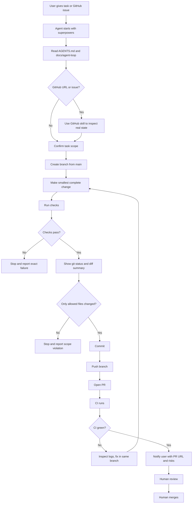

# Bemoat Web Starter

[](https://deploy.workers.cloudflare.com/?url=https://github.com/boat1994/bemoat-web-starter)

A reusable Payload 3, Next.js, and Cloudflare starter for Bemoat projects.

This starter is based on the Payload Cloudflare D1 template and extended with reusable CMS and frontend modules.

## What is included

- Payload 3 CMS
- Next.js app router frontend
- Cloudflare Workers deployment through OpenNext
- Cloudflare D1 database binding
- Cloudflare R2 media storage binding
- Generic project CMS schema
- Blog CMS schema
- Custom order page global
- Site settings global
- Thai and English localization
- One-command boilerplate sync for child projects
- VS Code and Cursor workspace defaults
- Payload CMS agent rules and Superpowers workflow guidance

## Source history

The first Bemoat boilerplate layer was extracted from working project code and cleaned up for reuse in new repositories.

## Agent and editor setup

This starter includes the same development guidance used in the source project:

- `AGENTS.md` for repository-wide Payload CMS development rules
- `.cursor/rules/*` for Cursor rules covering Payload collections, fields, hooks, access control, endpoints, adapters, plugins, custom components, and critical security patterns
- `.cursor/rules/superpowers-using-superpowers.mdc` to require the Superpowers skill workflow
- `.vscode/*` for recommended extensions, formatting, TypeScript SDK, and Next.js debugging

All coding agents should begin task work with:

```text
superpowers:using-superpowers
```

Skill source:

```text
/home/boat/.codex/plugins/cache/openai-curated/superpowers/c6ea566d/skills/using-superpowers/SKILL.md
```

Before responding, asking clarifying questions, planning, editing files, running implementation commands, or reviewing code, agents should check whether a skill applies and follow it first. User instructions remain the highest priority.

## Development workflow

Short task prompts are enough for agents working in this repository. The operating rules live in [AGENTS.md](./AGENTS.md), the step-by-step loop is in [docs/agent-loop](./docs/agent-loop/README.md), [security and migration guardrails](./docs/agent-loop/security-and-migrations.md) define stop conditions for secrets and D1 changes, GitHub issue and PR templates capture task scope, and CI validates every pull request.



## Important Cloudflare note

This template is expected to run on Cloudflare Paid Workers because the bundle can exceed the free Worker size limit.

Do not copy one project's Cloudflare resources into another project without changing them first:

- D1 database ID
- D1 database name
- R2 bucket name
- Worker name
- Environment variables
- Secrets

## Cloudflare deploy button settings

When Cloudflare asks for commands, use pnpm:

```text
Build command: pnpm run build
Deploy command: pnpm run deploy
```

The npm scripts internally use `pnpm exec` for OpenNext, Payload, and Wrangler so the local project binaries are used consistently.

## Local setup

```bash
pnpm install
pnpm wrangler login
pnpm dev
```

## Generate Payload files

Run these after changing Payload collections, globals, admin fields, or import map components:

```bash
pnpm run generate:importmap
pnpm run generate:types
```

## Create migrations

Run this before deploying schema changes to Cloudflare D1:

```bash
pnpm payload migrate:create
```

Review the generated migration before running deploy.

## Deploy

You can start from the Cloudflare deploy button at the top of this README, or deploy manually after setting up your Cloudflare resources.

```bash
pnpm run deploy
```

The deploy command runs database migration, optimizes D1, builds the app, and deploys the Worker.

After deploy, run the [deploy smoke test checklist](./docs/deploy-smoke-test.md) to confirm frontend, admin, Payload, D1, R2, and Cloudflare routing.

## Recommended project flow (deploy-first)

Real Bemoat projects should **not** start by cloning this repository directly. Use the deploy-first path:

1. Click **[Deploy to Cloudflare](https://deploy.workers.cloudflare.com/?url=https://github.com/boat1994/bemoat-web-starter)** at the top of this README.
2. Let Cloudflare create or connect the project and provision Worker, D1, R2, and secrets for that deployment.
3. Clone the **generated child project** repository locally (the repo Cloudflare creates or connects—not this starter).
4. Run local setup:

```bash
pnpm install
pnpm run generate:importmap
pnpm run generate:types
pnpm payload migrate:create
pnpm dev
```

5. Review any new migration, test locally, then deploy with `pnpm run deploy`.

After the project is real, configure project-specific values in the child repo:

- `package.json` name
- `wrangler.jsonc` Worker name
- D1 database config
- R2 bucket config
- Site metadata
- Domain and environment variables
- Agent rules that are no longer relevant to the child project

For the full agent operating loop, see [docs/agent-loop/README.md](./docs/agent-loop/README.md).

## Developing this starter

Clone this repository **only** when improving `bemoat-web-starter` itself (shared collections, starter pages, CI, agent docs, sync script):

```bash
git clone https://github.com/boat1994/bemoat-web-starter.git
cd bemoat-web-starter
pnpm install
pnpm dev
```

Do not use this clone-first path to start a customer or product repository.

## Boilerplate sync command

**Existing child projects** can pull the latest reusable boilerplate layer from this starter with one command. Sync is for **updating** projects that already exist after deploy—not the primary way to create a new project.

For **release tags, changelog policy, and when to sync from `main` vs a stable tag**, see [docs/releases.md](./docs/releases.md).

Before syncing, check which managed boilerplate files differ from the starter:

```bash
pnpm run boilerplate:check
```

When drift is reported, apply updates with:

```bash
pnpm run boilerplate:sync
```

By default, check and sync use:

```text
boat1994/bemoat-web-starter#main
```

For safer production updates, pin a version tag instead:

```bash
BEMOAT_BOILERPLATE_REF=v0.3.0-sync-rails pnpm run boilerplate:sync
```

## Sync from another branch

```bash
BEMOAT_BOILERPLATE_REF=dev pnpm run boilerplate:sync
```

## Sync from another repository

```bash
BEMOAT_BOILERPLATE_REPO=boat1994/bemoat-web-starter pnpm run boilerplate:sync
```

## What boilerplate sync updates

Shared workflow rails:

- `AGENTS.md` repository agent instructions
- `.cursor/rules/*` workflow instructions and Cursor rule files
- `.github/workflows/ci.yml` shared CI workflow
- `.github/pull_request_template.md` PR template
- `.github/ISSUE_TEMPLATE/agent-task.yml` agent task issue template
- `docs/agent-loop/*` agent operating loop docs

Sync tooling and docs:

- `scripts/sync-boilerplate.mjs` sync command updates
- `scripts/check-boilerplate-drift.mjs` drift check before sync
- `docs/dev-boilerplate.md` boilerplate module notes

Frontend starter pages:

- Home, projects index, project detail, blog index, blog detail, custom order page

Payload shared schema and utilities:

- Shared collections and globals
- Admin extension placeholder components
- Helper utilities
- `src/payload.config.ts`

Package scripts and dependencies:

- Validation rails: `check`, `check:full`, `typecheck`, `lint`, `test`, `test:int`
- Payload and sync: `generate:importmap`, `generate:types`, `generate:types:cloudflare`, `generate:types:payload`, `payload`, `boilerplate:sync`, `boilerplate:check`
- Shared `dependencies` and `devDependencies` from the starter (child projects run `pnpm install` to refresh their own lockfile)

`pnpm-lock.yaml` is **not** synced. Child projects may have project-specific dependencies; after sync, run `pnpm install` to update the local lockfile.

## What boilerplate sync does not update

The sync script intentionally does not overwrite project-specific infrastructure or content:

- `wrangler.jsonc`
- D1 database IDs
- R2 bucket names
- Worker names
- `.env` files
- Cloudflare secrets
- Root `README.md` (child projects may keep project-specific README wording; adopt starter README sections manually if desired)
- Project-specific business modules and integrations

This keeps each project safe while still allowing reusable code and agent workflow rails to move forward.

## After every sync

The sync command now creates a Git commit automatically for the files it manages:

- every synced path in `managedPaths`
- `package.json`
- `.bemoat-boilerplate-sync.json`

If you have local uncommitted changes first, the script stashes only files outside the sync-managed scope before syncing and restores them after the sync commit is created. Existing edits on sync-managed files are replaced by the fresh sync output instead of being reapplied afterward.

If a child project still has the older sync script, copy `scripts/sync-boilerplate.mjs` from this starter into that project once, then run sync again. Older copies of the script did not sync themselves forward.

Run:

```bash
pnpm install
pnpm run generate:importmap
pnpm run generate:types
pnpm payload migrate:create
```

Then review the migration and test locally before deploying.

## Current CMS modules

### Core

- Users
- Media
- BlogMedia

### Projects and portfolio

- Projects
- Categories
- Tags

### Blog

- Posts
- BlogCategories

### Globals

- SiteSettings
- CustomOrderPage

## Intentionally not included yet

The first boilerplate layer does not include project-specific operations modules:

- Orders
- LINE integration
- Payment slip review
- Copilot
- Handoff workflow

These modules depend on project-specific APIs, secrets, collections, and operations rules. Add them later as a separate boilerplate layer when the interface is stable.

## Useful commands

```bash
pnpm dev
pnpm run build
pnpm run preview
pnpm run deploy
pnpm run generate:importmap
pnpm run generate:types
pnpm payload migrate:create
pnpm run boilerplate:sync
pnpm run smoke:deploy
```

Set `BEMOAT_SMOKE_BASE_URL` to your deployed URL when running the optional smoke script. See [docs/deploy-smoke-test.md](./docs/deploy-smoke-test.md).

## Troubleshooting

### Build says `Unknown command: build`

Make sure the build script uses pnpm and OpenNext:

```json
"build": "cross-env NODE_OPTIONS=\"--no-deprecation --max-old-space-size=8000\" pnpm exec opennextjs-cloudflare build"
```

Do not use `payload build`.

### Admin field component not found

Run:

```bash
pnpm run generate:importmap
```

### Payload types are stale

Run:

```bash
pnpm run generate:types
```

### D1 schema does not match collections

Create and review a migration:

```bash
pnpm payload migrate:create
```

Then deploy only after the migration looks correct.
