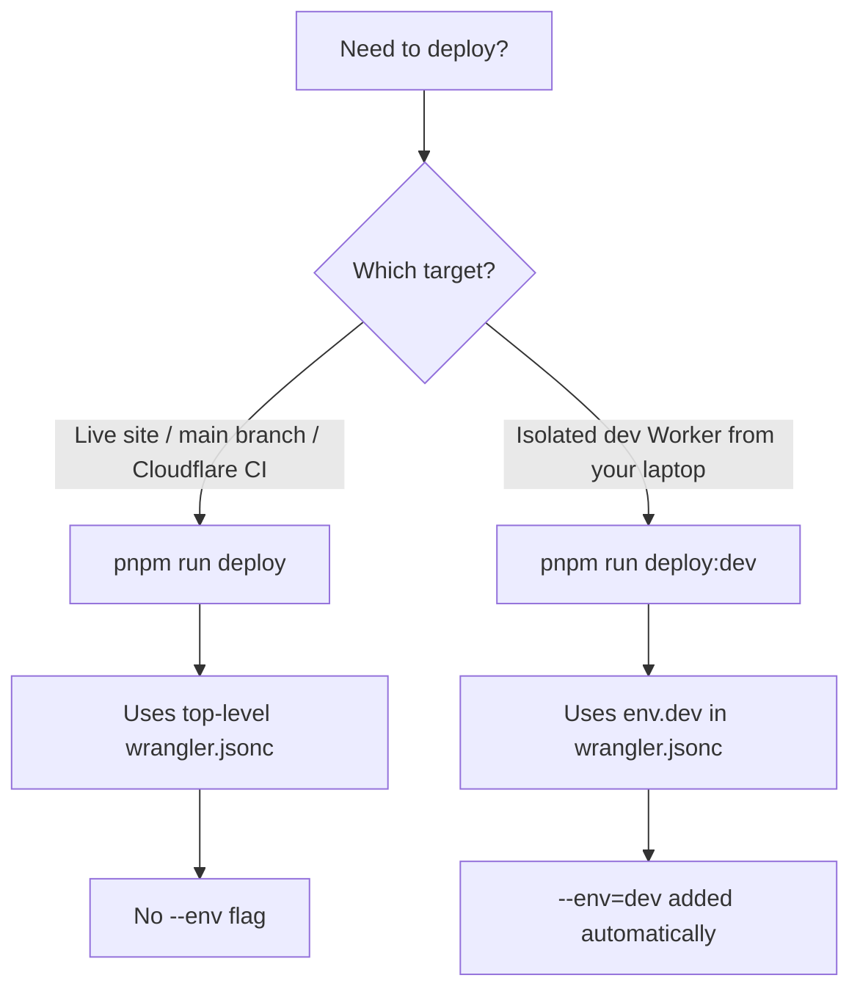

# Cloudflare environments (production vs dev)

This guide explains how Bemoat web projects deploy to Cloudflare Workers with **two separate targets**:

| Target | When to use | Command | Wrangler config |
| --- | --- | --- | --- |
| **Production** | Main branch auto-deploy, Cloudflare deploy button, manual production release | `pnpm run deploy` | Top-level `wrangler.jsonc` (no `--env`) |
| **Dev** | Local-only deploy to an isolated Worker, D1, and R2 | `pnpm run deploy:dev` | `wrangler.jsonc` → `env.dev` (passes `--env=dev`) |

**Mental model:** Production lives at the **root** of `wrangler.jsonc`. Dev is an **optional named environment** under `env.dev`. There is **no** `env.production` and you should **never** set `CLOUDFLARE_ENV=production`.

This file is **rails-managed** — child projects receive it via `pnpm run boilerplate:sync`. Project-specific Worker names, D1 IDs, and R2 bucket names stay in each child repo's `wrangler.jsonc` (not synced).

## Quick decision guide



| Question | Production | Dev |
| --- | --- | --- |
| Who runs it? | Cloudflare auto-deploy on `main`, or you intentionally releasing production | You, locally, when you need a remote dev stack |
| Worker name | Top-level `name` in `wrangler.jsonc` | `env.dev.name` (e.g. `my-project-dev`) |
| D1 database | Top-level `d1_databases` | `env.dev.d1_databases` — **separate** database |
| R2 bucket | Top-level `r2_buckets` | `env.dev.r2_buckets` — **separate** bucket |
| Pass `--env`? | **No** | **Yes** (`--env=dev`, set by `deploy:dev`) |
| Set `CLOUDFLARE_ENV`? | Leave unset | Set to `dev` (handled by `deploy:dev`) |

## Production deploy

Production uses the **top-level** section of `wrangler.jsonc`:

```jsonc
{
  "name": "my-project",
  "d1_databases": [{ "binding": "D1", "database_id": "...", "database_name": "my-project" }],
  "r2_buckets": [{ "binding": "R2", "bucket_name": "my-project" }]
}
```

### Commands

```bash
pnpm run deploy
```

This runs, in order:

1. `deploy:database` — Payload migrate + D1 `PRAGMA optimize`
2. `deploy:app` — OpenNext build + Worker deploy

Neither step passes `--env` when `CLOUDFLARE_ENV` is unset.

### Cloudflare deploy button / CI

Configure Cloudflare with:

```text
Build command: pnpm run build
Deploy command: pnpm run deploy
```

Do **not** set `CLOUDFLARE_ENV=production` in Cloudflare project settings or CI. That value makes Wrangler look for `env.production`, which this starter intentionally does not define.

### How the conditional `--env` works

Deploy scripts use bash parameter expansion:

```text
${CLOUDFLARE_ENV:+--env=$CLOUDFLARE_ENV}
```

- `CLOUDFLARE_ENV` unset → no `--env` flag → top-level production config
- `CLOUDFLARE_ENV=dev` → `--env=dev` → `env.dev` config

## Dev deploy (local only)

Dev is for an **isolated** Cloudflare stack: separate Worker, D1, and R2. Use it when you need to test migrations, admin, or media against remote bindings without touching production.

### One-time setup in your child project

1. **Create Cloudflare resources** (dashboard or Wrangler):
   - D1 database (e.g. `my-project-dev`)
   - R2 bucket (e.g. `my-project-dev`)
   - Note the D1 `database_id`

2. **Add `env.dev` to `wrangler.jsonc`** (copy pattern from starter; use your project's names and IDs):

```jsonc
"env": {
  "dev": {
    "name": "my-project-dev",
    "d1_databases": [
      {
        "binding": "D1",
        "database_id": "<YOUR_DEV_D1_ID>",
        "database_name": "my-project-dev",
        "remote": true
      }
    ],
    "r2_buckets": [
      {
        "binding": "R2",
        "bucket_name": "my-project-dev",
        "preview_bucket_name": "my-project-dev"
      }
    ]
  }
}
```

3. **Set dev secrets** (separate from production):

```bash
pnpm exec wrangler secret put PAYLOAD_SECRET --env=dev
```

4. **Deploy dev**:

```bash
pnpm run deploy:dev
```

`deploy:dev` runs `cross-env NODE_ENV=production CLOUDFLARE_ENV=dev pnpm run deploy`, so all migrate/build/deploy steps automatically target `env.dev`.

### Preview against dev bindings

```bash
CLOUDFLARE_ENV=dev pnpm run preview
```

## What not to do

| Avoid | Why |
| --- | --- |
| `CLOUDFLARE_ENV=production` | Wrangler expects `env.production` in config; we use top-level instead |
| `--env=production` in scripts | Same problem — causes "No environment found in configuration with name production" |
| Pointing `env.dev` at production D1 or R2 IDs | Dev and production data must stay isolated |
| Copying another project's D1 IDs or bucket names | Each project owns its own Cloudflare resources |
| Running `pnpm run deploy:dev` in Cloudflare CI | Dev deploy is **local-only**; CI and main branch use `pnpm run deploy` |

## Wrangler command cheat sheet

Replace `my-project` with your Worker name. Omit `--env` for production; add `--env=dev` for dev.

| Task | Production | Dev |
| --- | --- | --- |
| Deploy | `pnpm run deploy` | `pnpm run deploy:dev` |
| List D1 migrations | `pnpm exec wrangler d1 migrations list D1 --remote` | `pnpm exec wrangler d1 migrations list D1 --env=dev --remote` |
| Put secret | `pnpm exec wrangler secret put PAYLOAD_SECRET` | `pnpm exec wrangler secret put PAYLOAD_SECRET --env=dev` |
| Preview Worker | `pnpm run preview` | `CLOUDFLARE_ENV=dev pnpm run preview` |

## Child project checklist after boilerplate sync

When `pnpm run boilerplate:sync` updates deploy scripts from the starter:

1. Run `pnpm install` if `package.json` scripts changed.
2. Confirm your **production** bindings remain in the **top level** of `wrangler.jsonc` (sync does not overwrite this file).
3. If you use dev deploy, ensure `env.dev` exists with **your** dev D1 ID and R2 bucket — not the starter's placeholder IDs.
4. Production release: `pnpm run deploy`
5. Local dev release: `pnpm run deploy:dev`

## Related docs

- [Deploy smoke test](./deploy-smoke-test.md) — verify a deploy after production or dev release
- [README § Deploy](../README.md#cloudflare-environments-production-vs-dev) — starter overview
- [Security and migrations](./agent-loop/security-and-migrations.md) — stop conditions for production deploys and D1 changes
