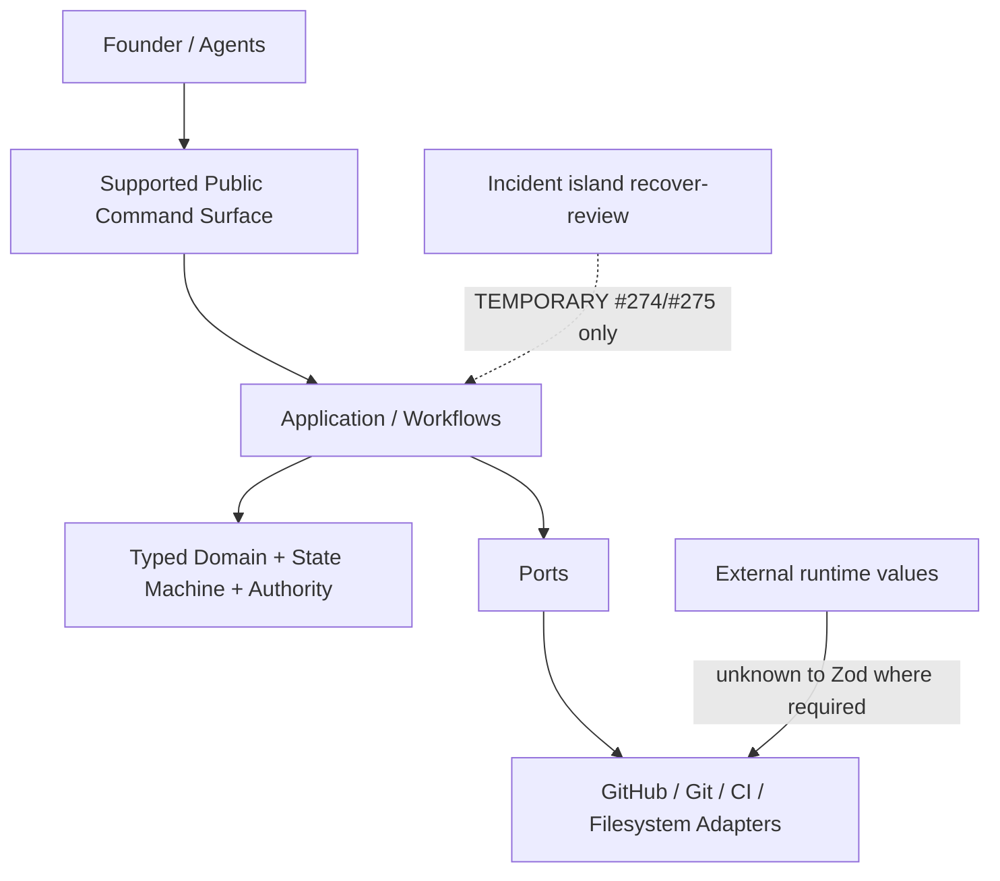
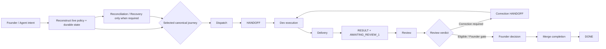
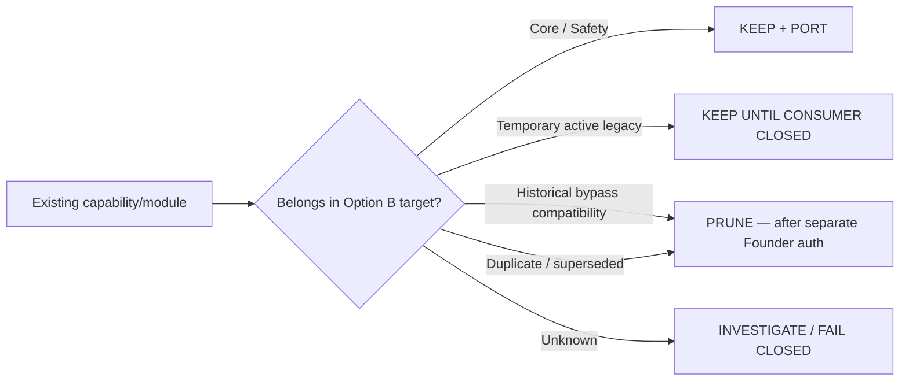
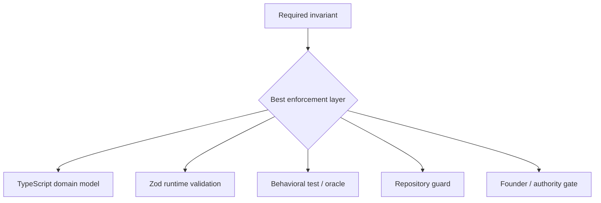

# Mission Control Architecture Blueprint

**Status:** Founder-approved **architectural direction** only.  
**Approved target:** **Option B — Pristine Journey Hub**.  
**Authority:** Founder decision on Issue [#340](https://github.com/boat1994/bemoat-web-starter/issues/340), derived from Draft PR [#341](https://github.com/boat1994/bemoat-web-starter/pull/341) design head `32944cc054b9023a1592dfb49c7d597536d15aac`.  
**Design record (non-normative):** `docs/superpowers/specs/bemoat/mission-control/architecture/design.md` at that SHA.  
**As-built evidence baseline:** protected `main@7cfd62b6197a2e95fc8dbe06e30e047550b85e2b` (PR #339 Phase-1 merge), as recorded in the approved design.  
**Policy (unchanged):** `docs/mission-control/mission-control-guide.md` remains the only long-form operating policy. This blueprint does **not** compete with the guide.

---

## 0. Authority, labels, and non-authorization

| Label | Meaning |
| --- | --- |
| **Approved: Option B — Pristine Journey Hub** | Founder-selected **architectural direction** for the target lean Mission Control harness |
| **RECOMMENDED — NOT APPROVED** | Design-record recommendation label on Option B in PR #341 — **superseded for direction** by Founder approval of Option B |
| **Direction only** | Normative target shape and dispositions; **not** authorization to change code, guards, or merge Draft PR #341 |

### Explicitly NOT authorized by this blueprint

This document does **not** authorize:

- pruning, deletion, or retirement of runtime files
- runtime or guard changes
- merge of Draft PR [#341](https://github.com/boat1994/bemoat-web-starter/pull/341)
- Issue [#333](https://github.com/boat1994/bemoat-web-starter/issues/333) Batch 6 / Cluster F
- Issue #333 closure
- deployment, production mutation, retained-data changes, or real child sync

Pruning and semantic simplification require **separate Founder authorization** after this blueprint is accepted as documentation.

### Preserve (non-negotiable under Option B direction)

- Founder authority
- exact-head binding and CI
- CAS / concurrency and fail-closed semantics
- deterministic reconciliation
- `recover-state`
- `reopen`
- real-world partial / ambiguous-failure recovery under correct canonical operation

### Temporary incident posture

| Capability | Posture |
| --- | --- |
| `recover-review` | **`INCIDENT_SPECIFIC` / TEMPORARY** for Issue [#274](https://github.com/boat1994/bemoat-web-starter/issues/274) / PR [#275](https://github.com/boat1994/bemoat-web-starter/pull/275) until that live consumer is separately resolved. Not a generic review-recovery API. Do not delete from static reachability alone; do not promote to core. |

---

## 1. Documentation roles

| Artifact | Role |
| --- | --- |
| `mission-control-guide.md` | **POLICY** — authority, governance, state/review invariants |
| `architecture-blueprint.md` (this file) | **ARCHITECTURE** — what Mission Control is, supported journeys/capabilities, boundaries, trust/recovery model, legacy status, target lean shape |
| `command-reference.md` | **USAGE** — how supported commands are invoked and public contracts |
| Superpowers design under `docs/superpowers/specs/.../architecture/design.md` | **DESIGN RECORD** — alternatives, rationale, correction history; not competing architectural authority after Founder direction approval |
| TypeScript / runtime code | **IMPLEMENTATION** of the approved architecture (only after separately authorized work) |

---

## 2. Design rule (journey-first)

Primary question (Founder amendment on #340):

> For each supported Mission Control case, what starts the journey, which canonical command is called, which validations and internal capabilities are required, what durable mutations occur, what failures are legitimate, and what exact terminal state / next permitted action ends the journey?

Retention in the target architecture requires at least one of:

1. participation in a supported canonical journey;
2. enforcement of a required invariant for one or more journeys;
3. real-world failure recovery still possible under correct canonical operation; or
4. an explicitly identified live temporary consumer.

Static reachability alone is insufficient for deletion authority. Deletion remains unauthorized until a separate Founder prune gate.

---

## 3. Supported execution architecture (target)

Option B refuses unsupported mimicry: agents must not reconstruct lifecycle by reading implementation source or mutating managed state ad hoc.

---

## 4. High-level journey map

Normal-success paths and exceptional recovery paths remain visibly distinct.

---

## 5. Canonical Journey Atlas (target dispositions)

Journey dispositions below are **architectural direction** for Option B. They do **not** authorize pruning of implementing files.

### Capability disposition (normative lens)

### J1 — Repository / policy / durable-state reconstruction

| Field | Content |
| --- | --- |
| Purpose | Reconstruct authoritative policy + live durable Task state before any mutating journey |
| Canonical commands | `pnpm run bemoat:agent:issue -- <n>` (read-only); policy load from protected `main` guide; raw GitHub reads for verification |
| Durable writes | **None** |
| Unsupported | Reconstructing transitions by reading/mimicking implementation source; manual YAML edits |
| Disposition | **KEEP** (CORE) |

### J2 — Task bootstrap / start

| Field | Content |
| --- | --- |
| Purpose | Founder-authorized managed-Task genesis (exceptional) |
| Canonical entrypoint | Protected workflow `mission-control-task-bootstrap.yml` + Founder authorization comment |
| Ordinary start | After a managed Task exists: **J3** (preceded by J1). `bemoat:agent:issue` does not create Tasks |
| Disposition | **KEEP** as **PLATFORM / exceptional genesis** |

### J3 — Dispatch → HANDOFF

| Field | Content |
| --- | --- |
| Canonical command | `pnpm run bemoat:mission-control:dispatch` |
| State | Authorized path to `IN_PROGRESS` with HANDOFF |
| Disposition | **KEEP** (CORE) |

### J4 — Delivery → RESULT → `AWAITING_REVIEW_1`

| Field | Content |
| --- | --- |
| Canonical command | `pnpm run bemoat:agent:delivery` |
| Trust | Exact head; required CI; single PR binding |
| Disposition | **KEEP** (CORE) |

### J5 — Review → `REVIEW_VERDICT`

| Field | Content |
| --- | --- |
| Canonical command | `pnpm run bemoat:mission-control:review` |
| Note | Do **not** use `recover-review` for ordinary review failure |
| Disposition | **KEEP** (CORE) |

### J6 — Correction → bounded Delta Review

| Field | Content |
| --- | --- |
| Commands | correction preflight → dispatch → delivery → delta review; optional `adopt-finding` |
| Disposition | **KEEP** (CORE); `adopt-finding` **KEEP** (CORE / authority) |

### J7 — Founder merge → `DONE`

| Field | Content |
| --- | --- |
| Canonical command | `pnpm run bemoat:mission-control:merge` |
| Trust | Founder allowlist; exact reviewed head; policy identity |
| Disposition | **KEEP** (CORE) |

### J8 — Deterministic reconciliation

| Field | Content |
| --- | --- |
| Canonical command | `pnpm run bemoat:mission-control:reconcile` |
| Scope | Routing-only projection repair; cannot initialize state, replay reviews, or invent verdicts |
| Disposition | **KEEP** (SAFETY / real-world recovery) |

### J9 — Real-world recovery

#### J9a — `recover-review` (**INCIDENT_SPECIFIC** / TEMPORARY)

| Field | Content |
| --- | --- |
| Purpose | Quarantine only the approved Issue **#274** / PR **#275** raw-review incident |
| Canonical command | `pnpm run bemoat:mission-control:recover-review` |
| Live consumer (reverified for this blueprint step) | Issue #274 **OPEN**; PR #275 **OPEN** (mergeable: CONFLICTING) |
| Disposition | **TEMPORARY KEEP** while live; do not port as generic capability |

#### J9b — `recover-state`

| Field | Content |
| --- | --- |
| Purpose | Recreate one wholly absent managed-state block from uniquely reconstructable immutable evidence |
| Disposition | **KEEP** (exceptional real-world recovery) |

#### J9c — `reopen`

| Field | Content |
| --- | --- |
| Purpose | Project Founder-authorized PR head drift to `FOUNDER_AUTHORIZED_CORRECTION` |
| Disposition | **KEEP** (CORE / Founder authority) |

### J10 — Canonical role-comment publication / readback

| Field | Content |
| --- | --- |
| Canonical command | `pnpm run bemoat:issue:comment` |
| Active dependency | `diagnostics/github-comment-projection` used by role-comment + agent-issue evidence paths |
| Disposition | **KEEP** publication path (CORE); comment-projection **KEEP until consumer closed / consolidated** |

### J11 — Child / harness sync (PLATFORM-adjacent)

| Field | Content |
| --- | --- |
| Commands | `pnpm run bemoat:boilerplate:check|sync -- --harness-only` (or `--full`) |
| Ownership | Platform / harness-sync (`docs/harness-sync-contract.md`); not an MC state-machine journey |
| Disposition | **SPLIT ownership:** PLATFORM capability MC policy depends on; retain commands; do not fold into J1–J10 |

---

## 6. Protection model

Option B minimizes duplicate independent implementations of the same invariant while preserving deliberate defense-in-depth where justified. Prefer typed domain + Zod at trust boundaries; keep independent guards where they protect platform/safety or Founder-gated integrity.

---

## 7. CURRENT AS-BUILT map (descriptive)

Evidence root for the census that informed Option B: `main@7cfd62b6197a2e95fc8dbe06e30e047550b85e2b`. Live refs must be reverified before any later prune authorization.

### 7.1 Public command surface

| Command | Role |
| --- | --- |
| `bemoat:agent:issue` | Read-only reconstruction / preflight (J1) |
| `bemoat:agent:delivery` | Delivery (J4) |
| `bemoat:mission-control:dispatch` | Dispatch (J3) |
| `bemoat:mission-control:review` | Review (J5/J6) |
| `bemoat:mission-control:merge` | Merge (J7) |
| `bemoat:mission-control:reconcile` | Reconcile (J8) |
| `bemoat:mission-control:recover-review` | **INCIDENT_SPECIFIC** J9a |
| `bemoat:mission-control:recover-state` | J9b |
| `bemoat:mission-control:reopen` | J9c |
| `bemoat:mission-control:adopt-finding` | J6 optional |
| `bemoat:mission-control:task-bootstrap` | J2 implementation surface |
| `bemoat:issue:comment` | J10 |
| `bemoat:boilerplate:check|sync` | J11 PLATFORM |
| `bemoat:guard:*` / validation scripts | Guards & validation |

**Unsupported agent behavior (explicit):** reconstructing lifecycle by reading implementation source; ad-hoc managed-state mutation; replacing canonical commands with raw `gh issue edit`.

### 7.2 Domain / state / authority ownership (as-built)

| Concern | Owner (as-built) |
| --- | --- |
| Managed Task state parse/render | `domain/task-state.*` (+ authorization helper) |
| Review verdict projection/transition | review-verdict modules + `workflows/review` |
| Merge authority / terminal bundle | merge domain + `workflows/merge` + Founder allowlist |
| Campaign parse/validate/normalize | `domain/campaign-*` (Zod boundary in validator) |
| Correction contract | correction-contract modules |
| Reconciliation analysis | bounded-reconciliation / reconciliation modules + `workflows/reconcile` |
| Recover-review / recover-state | dedicated workflows + adapters + domain evidence modules |

Durable SoT: Issue managed-state markers + immutable role comments + PR head/CI; Founder auth comments for merge/reopen/adoption/recovery.

### 7.3 Runtime trust / Zod boundaries

| Boundary | As-built |
| --- | --- |
| CLI invocation / help / result envelopes | CLI command schemas + Zod |
| Campaign external evidence | campaign validator boundary / schemas |
| Native TS execution | Node type-stripping; `typescript-runtime-contract.md`; `bemoat:typecheck` |
| Remaining `.mjs` production | Still authoritative for many workflows/entrypoints |

Principle: unknown external runtime values → Zod (or equivalent fail-closed parse) at adapter/CLI boundary; domain prefers typed modules.

### 7.4 Reconciliation / recovery classes

| Mechanism | Class |
| --- | --- |
| `reconcile` | Real-world routing repair (**KEEP**) |
| `recover-state` | Exceptional absent-state reconstruction (**KEEP**) |
| `recover-review` | **INCIDENT_SPECIFIC** #274/#275 only (**TEMPORARY**) |
| `reopen` | Founder-authorized correction path (**KEEP**) |
| Agent-bypass compatibility shims | Candidates for semantic simplification **only after separate Founder prune auth** — not “recovery” |

### 7.5 Compatibility facades (evidence-backed candidates — not deletion authority)

| Path | Tentative class |
| --- | --- |
| `domain/brainstorming.mjs` | Low-risk facade cleanup candidate (Class A) |
| `domain/task-state-authorization.mjs` | Low-risk facade cleanup candidate (Class A) |
| `domain/merge-head-bindings.mjs` | Low-risk facade cleanup candidate (Class A) |
| `workflows/campaign-projection.mjs` | Investigate / possibly KEEP as workflow helper |
| `diagnostics/github-comment-projection.mjs` | **KEEP** (active imports) |

Inventory counts on baseline (design evidence): **87** `scripts/mission-control/**/*.mjs`, **68** `*.ts`; of `.mjs`, ~**34** paired re-export facades and ~**53** mjs-only implementation files.

### 7.6 Tests / protected oracles

| Item | Note |
| --- | --- |
| Protected oracles (SHA-256) | Tracked in structural-protection manifest; anti-tampering retained under Option B |
| Grandfathered line ceilings | Migration ratchet; Option B targets **SPLIT** from oracle integrity (retirement still requires separate auth) |
| Int suite | `pnpm run bemoat:test:int` / vitest Mission Control specs |

### 7.7 Live temporary consumers

| Consumer | Implication |
| --- | --- |
| Issue #274 / PR #275 | Pins `recover-review` as TEMPORARY |
| Issue #333 | Migration frozen pending architecture checkpoint; Batch 6 **not** authorized by this blueprint |

---

## 8. Guard-pack audit (exact 13 IDs) — Option B target dispositions

Source: `GUARD_PACK` in `scripts/guards/pack.mjs` on protected main. Aggregator `pack.mjs` is **not** one of the 13 IDs.

| # | Guard ID | Option B disposition (direction) |
| --- | --- | --- |
| 1 | `repo-safety` | **RETAIN** (PLATFORM/SAFETY) |
| 2 | `harness-contract` | **RETAIN** (PLATFORM) |
| 3 | `build-script-contract` | **RETAIN** platform; alias subset may be semantic-simplification candidate later |
| 4 | `package-manager` | **RETAIN** |
| 5 | `toolchain-contract` | **RETAIN** |
| 6 | `env-placeholder` | **RETAIN** |
| 7 | `cloudflare-config` | **RETAIN** (pack id name must stay `cloudflare-config`) |
| 8 | `frontend-seo` | **RETAIN as PLATFORM** or **SPLIT** out of “MC lean pack” (Founder may decide pack membership later) |
| 9 | `mission-control-contract` | **RETAIN**; rule-level audit later under separate prune auth |
| 10 | `planning-contract` | **RETAIN** |
| 11 | `mission-control-drift` | **RETAIN now**; optional later **MERGE** into typed-domain/tests once TS owns matrices |
| 12 | `structural-protection` | **RETAIN**; **SPLIT** oracle integrity vs line-count ratchet (oracle hashes keep; ratchet rebaseline/retire only after separate auth) |
| 13 | `scripts-architecture` | **RETAIN concept**; **rebaseline** contract to this approved blueprint only after separately authorized update |

---

## 9. TARGET LEAN ARCHITECTURE — Option B Pristine Journey Hub

**Founder-approved architectural direction.** Design-record label `RECOMMENDED — NOT APPROVED` is superseded for **direction** only.

| Dimension | Option B target |
| --- | --- |
| Supported journeys | J1–J11 as dispositioned (J11 PLATFORM-adjacent); refuse unsupported mimicry |
| Public command surface | Canonical commands only; Class A facades removable only after separate Founder prune auth; Class B bypass-only compatibility removable only after separate Founder prune auth with live-consumer checks |
| Recovery posture | Keep J8 + J9b + J9c; J9a remains **INCIDENT_SPECIFIC** until #274/#275 resolved — **not** promoted to generic API |
| Compatibility posture | Least tolerance for agent-bypass; fail closed on non-canonical entry |
| Guard strategy | Retain PLATFORM guards (1–8, 10); keep MC contract + drift initially; SPLIT structural-protection concerns; rebaseline `scripts-architecture` to this blueprint under later auth; optional drift MERGE once TS owns matrices |
| TS/Zod ownership | Port only journey-justified modules; do not TypeScript-port prune candidates |
| Estimated surviving TS migration surface (after future authorized prune) | ~**35–45** semantic MC files after Class A + evidence-backed Class B (excludes TEMPORARY incident modules until retired) — planning estimate only |
| Risks if pruning is later authorized carelessly | Over-pruning if live consumers missed; short-term breakage for out-of-contract agent habits |

### Pruning / simplification classes (still unauthorized)

| Class | Meaning | Authorization |
| --- | --- | --- |
| **A. Low-risk dead/facade cleanup** | Collapse re-export-only `.mjs` after importers/tests updated | **Not authorized** by this blueprint |
| **B. Intentional semantic simplification** | Retire bypass-tolerance or duplicate SoT | **Not authorized** by this blueprint |
| **C. Temporary incident-specific** | Keep until live consumer closed | Keep posture only |
| **D. Permanent real-world recovery** | Keep under correct canonical operation | Preserve |

---

## 10. Options disposition (historical)

| Option | Design status | Founder direction |
| --- | --- | --- |
| A — Journey Hub + thin compatibility | Proposed | Not selected |
| **B — Pristine Journey Hub** | Was `RECOMMENDED — NOT APPROVED` in design record | **Approved as architectural direction** |
| C — Dual-track incident island | Proposed | Not selected |

Draft PR #341 remains a design PR. It is **not** merged by this blueprint step.

---

## 11. Remaining Founder decisions (after this documentation step)

1. Whether to authorize **pruning** (Class A first recommended) as a separate gate.
2. Whether **`frontend-seo`** remains in the central pack vs platform-only optional pack.
3. Whether **`structural-protection` line-count ratchet** is retired/split after decomposition goals, while retaining oracle hashes.
4. When **#274/#275** close, whether to delete or redesign `recover-review` (default proposal: delete incident transport after consumer closed).
5. Sequencing of Class A facade cleanup vs Class B semantic simplification.
6. Whether Draft PR #341 should remain open as historical design evidence, be closed without merge, or be superseded by other docs PRs.

---

## 12. Stop / non-claims

This blueprint publishes Founder-approved **Option B architectural direction**.

It does **not**:

- prune files
- modify guards or Mission Control runtime
- merge PR #341
- start Issue #333 Batch 6 / Cluster F
- close Issue #333 or Issue #340 by itself
- deploy or mutate production / retained data
