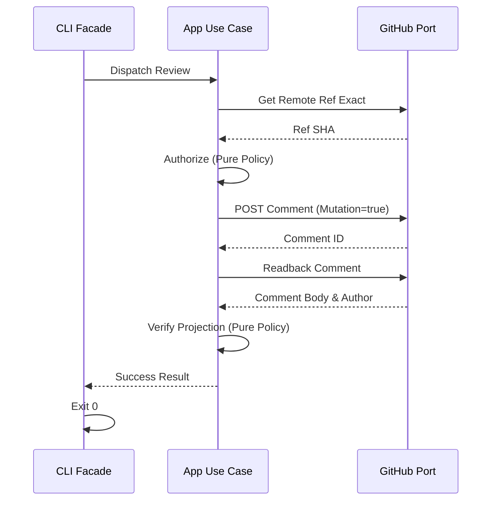
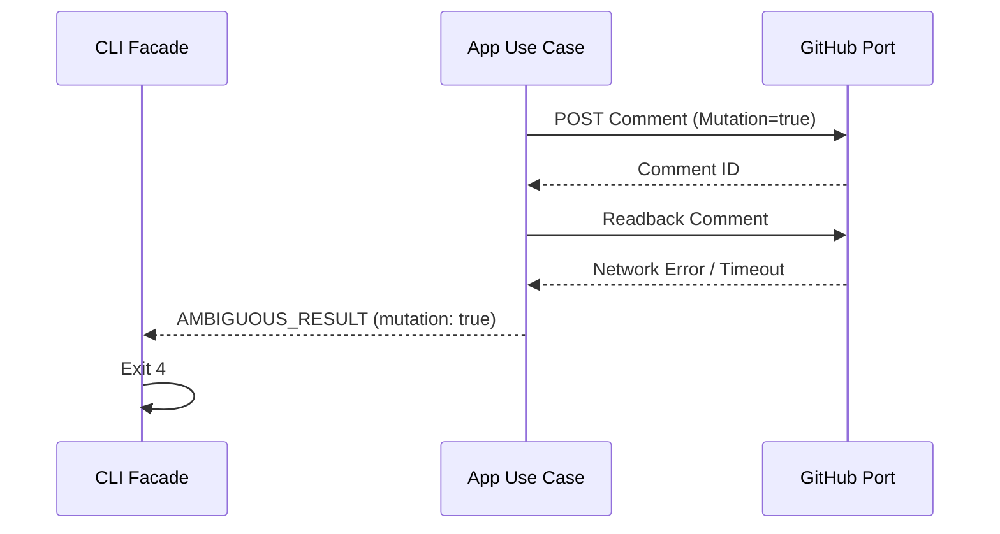
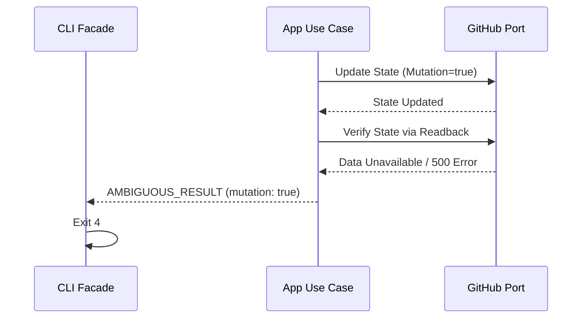
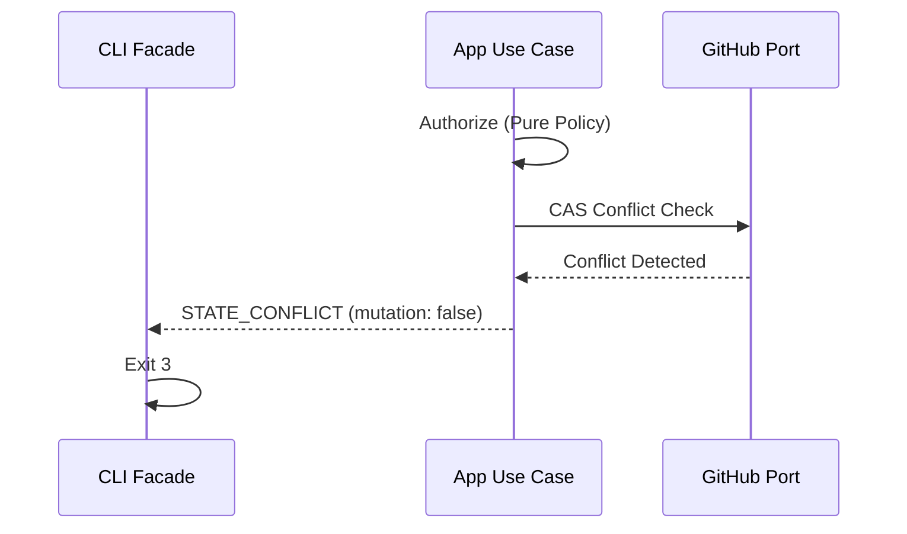
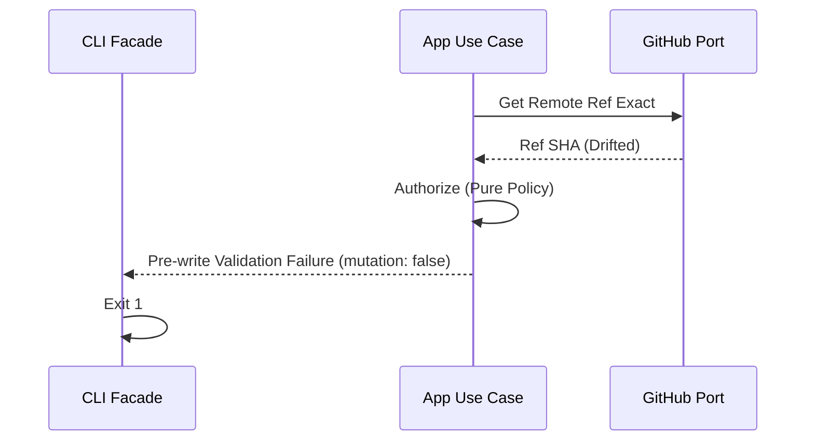

<!-- bemoat-task-identity:start -->
```yaml
schema_version: 1
main_issue: null
task_key: "issue-276"
task_issue_strategy: "existing_dedicated_issue"
active_task_issue: "#276"
branch_template: "docs/276-continuation-design"
transition_target: "AWAITING_REVIEW_1"
planning_base_sha: "777b2713fb3f380cd23db448abda752f28d5b120"
execution_base_rule: "resolve_live_protected_base_at_dispatch"
paired_spec: "docs/superpowers/specs/2026-08-06-issue-276-sliced-continuation-design.md"
paired_plan: null
```
<!-- bemoat-task-identity:end -->

# Issue #276 Sliced Continuation Design

## 1. Context and verified baseline

*   **Protected `main` SHA**: `777b2713fb3f380cd23db448abda752f28d5b120`
*   **Merged Tasks 1–4 boundary**: Tasks 1–4 are fully merged (via PR #290), serving as the foundational contract base for remaining slices.
*   **Unresolved Issues #286–#288**:
    *   **#286**: Task 5 authority and durable readback exact-head review.
    *   **#287**: Task 6 recover-review and reopen ambiguity handling exact-head review.
    *   **#288**: Task 7 DEV validation (reconcile and merge facade adaptation).
*   **Frozen PR #289 role**: Frozen, open, unmerged, and unchanged. Used solely as an immutable salvage source for patch transplanting.
*   **Immutable stash identities**:
    *   Task 5 stash: `ea961167192c1413d5953a4bb7be996565ca0b9b`
    *   Task 7 stash: `07f64144fc0f3ca8728830a9cb20248415deb125`
*   **Current authorization boundary**: This document represents design/spec preparation only. No implementation, stash application, or data mutation is authorized at this stage.

## 2. Design goals

*   Small, independently reviewable PRs mapped exactly to slices.
*   Deterministic authority and mutation handling with guaranteed safe failure modes.
*   SOLID responsibility boundaries replacing monolithic procedural flows.
*   Absolute preservation of existing Mission Control semantics.
*   No duplicate source of truth across parsers, results, routing, or authority.
*   Reduced context and review burden for each slice.

## 3. Non-goals

This design explicitly prohibits the following:

*   Broad, speculative facade refactoring outside the targeted slice scope.
*   State-machine redesign or fundamental shifts in transport ownership.
*   Introduction of a generic CLI framework.
*   Repository-wide "clean architecture" migration.
*   Cosmetic splitting or abstraction based solely on line count.
*   Child sync, deployment, or production work during the Issue #276 continuation.

## 4. Architecture and dependency direction

The dependency flow strictly enforces policy isolation:

```text
CLI facade
→ application use case
→ pure policy and outcome contracts
→ ports
→ adapters
```

**Responsibilities and Dependency Constraints:**

*   **CLI facade**: Exclusively routes arguments to use cases and maps domain responses to standard JSON envelopes/exit codes. *Prohibited: Owning domain decisions or orchestrating complex control flow.*
*   **Application service/use case**: Coordinates between domain policies and ports to execute workflows. *Prohibited: Implementing direct external API calls.*
*   **Authority policy**: Contains pure decisions derived from provided context. *Prohibited: Importing or invoking adapters directly.*
*   **Exact-ref/base/head policy**: Responsible for exact identity validation. Must remain pure.
*   **Mutation-outcome tracker**: Reliably tracks state changes to prove whether a write was initiated.
*   **Durable-readback verifier**: Proves post-write persistence by querying live state.
*   **Repository/state/comment ports**: Define exact behavioral contracts for required external IO.
*   **GitHub/git/filesystem adapters**: Implements ports via concrete external interactions. *Prohibited: Making policy decisions.*
*   **Result mapper**: Pure translation layer for returning standard exits.

**Constraint**: Domain policies must never import adapters. Facades must never own domain decisions.

## 5. SOLID interpretation

*   **SRP (Single Responsibility Principle)**: Each extracted unit must have exactly one reason to change.
*   **OCP (Open/Closed Principle)**: Classifications, adapters, and domain results are extended through existing canonical contracts, not duplicated `switch` statements across facades.
*   **LSP (Liskov Substitution Principle)**: Ports define strict behavioral contracts. Adapters must honor ambiguity signals and no-write guarantees.
*   **ISP (Interface Segregation Principle)**: Use-case-specific narrow ports are required (e.g., a specific port for posting a role comment) rather than a monolithic `GitHubClient` interface.
*   **DIP (Dependency Inversion Principle)**: Workflows depend on abstract ports and pure policies, completely isolated from command execution details (e.g., `gh` CLI flags).

*Note*: Creating interfaces without multiple implementations or testability value is not automatically required. Abstraction must solve concrete structural or testing blockers.

## 6. Shared versus slice-local components

**Abstractions permitted for introduction in Slice A and subsequent reuse:**
*   Mutation outcome state definitions.
*   Exact identity evidence models.
*   Durable readback result formats.
*   Ambiguity classification mapping.

**Slice-local components:**
*   Policies or ports unique to a specific workflow must remain local to that slice unless explicitly needed by a later slice.

*Constraint*: No shared abstraction may be introduced solely because a later slice might theoretically need it.

## 7. Per-slice design

### Slice A — Task 5 authority and durable readback
*   **Objective**: Implement durable readback and exact-head validation for delivery flows.
*   **Accepted inputs**: CLI args for target repo, base, head, and issue numbers.
*   **Responsibilities**: Verify exact remote ref, validate PR/base/head evidence, execute POST, track potential mutations, read back final state.
*   **Files touched**: `scripts/agent-delivery.mjs`, `scripts/mission-control-review.mjs`, pure policy extractions.
*   **Dependencies**: exact-ref/base/head policy, mutation-outcome tracker, durable-readback verifier, GitHub port.
*   **Allowed extractions**: Pure policies for authority and readback; ports for comment creation/reading.
*   **Prohibited changes**: Unrelated logic in other workflows.
*   **Salvage sources**: Task 5 stash `ea961167192c1413d5953a4bb7be996565ca0b9b`, PR #289.
*   **Test strategy**: Pure policy tests, mutation-boundary tests, exact-head CI.
*   **Review boundary**: Local validation → Exact-head CI → Semantic Review → Founder Merge.
*   **Completion gate**: Independent PR reviewed and merged.

### Slice B — Task 6 bootstrap ambiguity handling
*   **Objective**: Apply rigorous ambiguity classification mapping to the bootstrap phase.
*   **Responsibilities**: Translate bootstrap failures into unambiguous domain signals, separating `AMBIGUOUS_RESULT` from clean failures.
*   **Salvage sources**: PR #289 lineage.
*   **Completion gate**: Independent PR reviewed and merged.

### Slice C — Task 6 recover-review and reopen ambiguity handling
*   **Objective**: Safely handle post-write errors and proven pre-write conflicts during recovery and reopen operations (addressing Issue #287).
*   **Responsibilities**: Ensure `STATE_CONFLICT` is preserved when a write is provably prevented, and apply `AMBIGUOUS_RESULT` explicitly when authorization readback or write state is uncertain.
*   **Salvage sources**: PR #289 lineage.
*   **Completion gate**: Independent PR reviewed and merged.

### Slice D1 — boundary-harness instrumentation correction
*   **Objective**: Resolve harness-induced mutation reports to cleanly support Task 7 (addressing Issue #288).
*   **Responsibilities**: Modify test boundaries or snapshot strategies to exclude intentional test-artifact writes without weakening production zero-I/O guarantees.
*   **Salvage sources**: None from PR #289. Purely test infrastructure.
*   **Completion gate**: Independent PR reviewed and merged.

### Slice D2 — Task 7 reconcile and merge facade adaptation
*   **Objective**: Integrate reconcile and merge operations into the thin facade pattern.
*   **Responsibilities**: Delegate logic to pure policies, mapping to existing canonical contracts.
*   **Salvage sources**: Task 7 stash `07f64144fc0f3ca8728830a9cb20248415deb125`, PR #289.
*   **Completion gate**: Independent PR reviewed and merged.

### Slice E — Task 8 pure routing resolver and coverage
*   **Objective**: Finalize and fully test the routing resolver that connects Mission Control inputs to specific use cases.
*   **Responsibilities**: Prove all CLI entry routes resolve safely.
*   **Salvage sources**: PR #289.
*   **Completion gate**: Independent PR reviewed and merged.

### Slice F — Tasks 9–10 documentation, guard wiring and final delivery
*   **Objective**: Wrap up Issue #276 through final CI integration and documentation updates.
*   **Responsibilities**: Generate documentation reflecting the new boundaries, complete guard wiring, verify full regression passes.
*   **Completion gate**: Final PR merged, Issue #276 formally closed.

## 8. Slice A detailed design

**Task 5 Behavior Rules:**
*   **Exact remote ref comparison**: Must pull and verify the exact SHA for head/base against the remote source of truth before proceeding.
*   **Canonical PR/base/head evidence**: Evidence objects must be strictly validated. Missing data leads to an immediate, safe exit.
*   **POST identity preservation**: Ensure the metadata and signature attached to the comment are structurally validated and persist.
*   **Trusted author and association verification**: The actor performing the review/delivery must meet the established exact-head permission policy.
*   **Possible-mutation tracking**: The state boundary must record `mutation: true` if an external write is attempted, even if the result is unknown.
*   **Final live readback**: A read query must fetch the projected comment to confirm exact application.
*   **`AMBIGUOUS_RESULT` vs. proven pre-write stop**:
    *   If a write fails due to network/auth but the mutation tracker confirms no payload left the boundary: Safe pre-write failure.
    *   If a write is attempted and connection resets: `AMBIGUOUS_RESULT` (mutation considered true).
*   **JSON envelope and exit-code mapping**: Standard deterministic exits (0 for success, non-zero explicitly mapped to error states).

**Sequence: Successful comment POST and projection**


**Sequence: POST succeeds but readback is unknown**


**Sequence: State write succeeds but final verification is unknown**


**Sequence: Proven pre-write failure**


**Sequence: Exact-head or base drift**


## 9. Long-file policy

Relevant long files are classified as:
*   Declarative SOT
*   Test matrix
*   Production workflow

**Concrete extraction triggers:**
*   No isolated test seam exists to verify a complex conditional path.
*   Adapter construction (e.g., fetching URLs) is mixed with policy decision (determining if the outcome is valid).
*   Mutation and readback state cannot be proven separately.
*   Repeated corrections across the same responsibility require isolated targeting.
*   Bounded review cannot easily prove operation ordering within the file.

*Line count alone must not trigger mandatory refactoring.*

## 10. Testing architecture

*   **Pure policy tests**: Unit tests covering decision matrices with zero external dependencies.
*   **Port contract tests**: Ensure adapters implement expected ambiguity and failure behaviors.
*   **Adapter characterization tests**: Lock in existing `gh` behavior patterns to ensure regressions are caught.
*   **Mutation-boundary tests**: Verify that safe failures report `mutation: false` and ambiguous failures report `mutation: true`.
*   **Ambiguity-path tests**: Specifically mock connection failures post-write to verify `AMBIGUOUS_RESULT` handling.
*   **Existing behavior regression tests**: Maintain compatibility with the established Task 1–4 canonical outputs.
*   **Exact-head CI requirements**: PRs must successfully pass CI on the exact head commit without unrecorded drift.

Tests must demonstrably prove that abstractions preserve semantics and enforce guarantees rather than merely increasing file count.

## 11. Salvage protocol

Safe use of PR #289 and local stashes mandates the following:
*   **Branching**: Every slice operates on a fresh branch starting from the current protected `main`.
*   **Inspection**: Inspect exact commit, hunk, or stash patch meticulously.
*   **Transplant**: Port only the required behavior required for the current slice.
*   **Retention**: Ensure merged Tasks 1–4 corrections remain completely intact.
*   **Prohibited**: No bulk cherry-picking. No whole-branch rebasing.
*   **Stashes**: Do not apply a stash until its corresponding slice is officially authorized for implementation.
*   **Source evidence**: PR #289 must remain open to preserve source evidence until the corresponding slice is merged.

## 12. Review and Founder gates

Each slice enforces strict sequential gates:
1.  **Local validation**: Tests, typechecks, and linters must pass.
2.  **Exact-head CI**: Automation passes on the precise commit matching the PR head.
3.  **Independent semantic review**: Reviewer assesses semantic correctness against design, not just syntactic validity.
4.  **Blocker-only correction loop**: Iterations occur only for proven defects or contract violations.
5.  **Founder merge approval**: Mandatory authorization prior to merging into `main`.

Do not reset review cycles from chat or local state. All reviews are durable records on GitHub.

## 13. Open design decisions

*No unresolved design decisions identified at this stage that require Founder input prior to Slice A implementation planning.*
