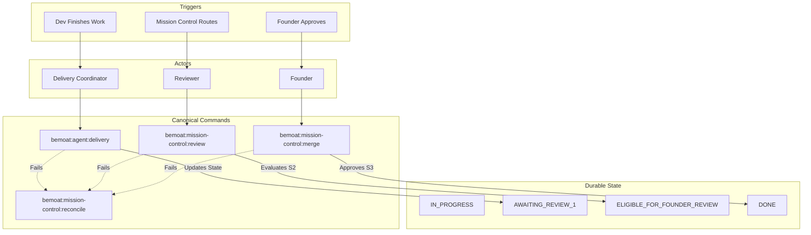

# Mission Control Architecture Audit & Planning (Issue #340)

This plan addresses the Issue #340 architecture audit under the Journey-first Founder amendment. It maps out the Canonical Journey Atlas for Mission Control operations, audits the 13 guards to separate essential recovery from historical bypass compatibility, and presents Target Lean Architecture options.

## Canonical Journey Atlas

The Canonical Journey Atlas traces the exact path for the primary Mission Control operations. By mapping these journeys, we establish the true capability map and identify redundancy or legacy bypasses.

### 1. Delivery Journey (Dev)
**Trigger**: Dev finishes implementation.
**Actor**: Dev (Delivery Coordinator)
**Public Command**: `bemoat:agent:delivery`
**Ordered Internal Calls**: Parse HANDOFF -> Verify exactly 1 commit/PR -> Verify CI -> Check Branch Guard -> Check Mission Control Contract Guard
**Trust Boundaries**: Agent to GitHub (Read), CI status (Read), Issue (Write block)
**Durable Reads/Writes**: Reads `READY`/`IN_PROGRESS` state. Writes `AWAITING_REVIEW_1` + PR exact head + RESULT comment.
**State Transition**: `IN_PROGRESS` -> `AWAITING_REVIEW_1`
**Legitimate Failure/Recovery**: CI fails (`BLOCKED_EXTERNAL`), State mismatch (`STATE_CONFLICT`). Recovery via `bemoat:mission-control:reconcile`.
**Terminal Result**: PR marked ready for review.
**Next Permitted Action**: Review (Reviewer).

### 2. Review Journey (Reviewer)
**Trigger**: Mission Control routes task to Reviewer.
**Actor**: Reviewer
**Public Command**: `bemoat:mission-control:review`
**Ordered Internal Calls**: Parse verdict -> Check Head SHA match -> Verify Findings
**Trust Boundaries**: Reviewer identity, Evidence verification against `exact_head`
**Durable Reads/Writes**: Reads `AWAITING_REVIEW_*`, Writes `CORRECTION_REQUIRED_*` or `ELIGIBLE_FOR_FOUNDER_REVIEW` + `REVIEW_VERDICT` comment + increments counters.
**State Transition**: `AWAITING_REVIEW_N` -> `CORRECTION_REQUIRED_N` or `ELIGIBLE_FOR_FOUNDER_REVIEW`
**Legitimate Failure/Recovery**: Verdict format invalid, missing head SHA. Recovery via `bemoat:mission-control:recover-review`.
**Terminal Result**: Verdict recorded and state advanced.
**Next Permitted Action**: Correction (Dev) or Merge (Founder).

### 3. Merge Journey (Founder)
**Trigger**: Task passes review, Founder approves merge.
**Actor**: Founder
**Public Command**: `bemoat:mission-control:merge`
**Ordered Internal Calls**: Verify auth -> Verify `ELIGIBLE_FOR_FOUNDER_REVIEW` -> Merge PR -> Post RESULT -> Close Issue -> Write DONE.
**Trust Boundaries**: Verified Founder identity against `BEMOAT_FOUNDER_LOGINS`.
**Durable Reads/Writes**: Reads Merge Approval + State, Writes `DONE`, Closes PR/Issue.
**State Transition**: `ELIGIBLE_FOR_FOUNDER_REVIEW` -> `DONE`
**Legitimate Failure/Recovery**: Missing approval (`BLOCKED_FOR_FOUNDER_DECISION`), CAS write failure. Recovery via `bemoat:mission-control:reconcile`.
**Terminal Result**: Code merged, Issue closed.
**Next Permitted Action**: Next task in Campaign.

---

## 13 Guards Audit

We audited all 13 guards in `scripts/guards/` to distinguish essential safety and real-world recovery from historical bypass compatibility.

### Essential Safety & Real-World Recovery
1. **`structural-protection.mjs`**: Hard code boundaries / algorithm constraints. Essential structural safety.
2. **`package-manager.mjs`**: Prevents NPM/Yarn drift. Essential invariant.
3. **`cloudflare-env.mjs`**: Prevents `CLOUDFLARE_ENV=production` deploy leaks. Essential security.
4. **`repo-safety.mjs`**: Blocks destructive migrations and restricts ignored files. Essential safety.
5. **`planning-contract.mjs` & `planning-contract-runtime.mjs`**: Validates the Task Block schemas. Essential for state machine integrity.
6. **`mission-control-drift.mjs`**: Enforces enum parity between scripts and guides. Essential integration test.
7. **`pack.mjs`**: Aggregator for safety. Essential pipeline element.
8. **`toolchain-contract.mjs`**: Enforces toolchain versions. Essential consistency.
9. **`env-placeholder.mjs`**: Validates `.env.example`. Good standard practice.

### Historical Bypass / Compat / Pruning Candidates
10. **`build-script-contract.mjs`**: Contains `cf:build` compatibility alias checks. (Candidate for Pruning/Lean out, as it supports legacy bypass).
11. **`frontend-seo.mjs`**: Scans for SEO exports. This is a business-level check, not a critical architectural guard. (Pruning candidate).
12. **`scripts-architecture.mjs`**: Contains `FACADE_DISPOSITIONS` logic which explicitly handles legacy aliases and routing facades. (Candidate to Lean Out by removing facades and forcing exact commands).

### Command Re-classification
* **`bemoat:mission-control:recover-state` & `recover-review`**: Essential **real-world recovery** tools when external platforms (GitHub, agent APIs) fail mid-write. They require identical evidence verification to normal pathways.
* **`cf:build` and other aliases**: These are **historical bypass compatibility** facades designed to catch agents that ignore the proper CLI discovery.

---

## Capability, Module, & State Map

**Module Ownership**:
- **Coordination Core**: `mission-control-dispatch.mjs`, `mission-control-reconcile.mjs`, `mission-control-merge.mjs`
- **Delivery Core**: `agent-delivery.mjs`, `agent-issue.mjs`
- **Guards**: `scripts/guards/*.mjs`

**State & Authority Map**:
- **GitHub Issue Description**: Authoritative for Current Mission Control State (`AWAITING_REVIEW_X`, `DONE`, etc.) and Active Task pointer.
- **GitHub Pull Request**: Authoritative for `exact_head` and changed files.
- **`BEMOAT_FOUNDER_LOGINS`**: Authoritative for `merge`, `reopen`, and `destructive` operations.

---

## Target Lean Architecture Option Selected

### Option 1: The Pristine Hub (Approved)
Removes all compatibility facades and legacy bypass paths. Agents are forced to use the exact `bemoat:mission-control:*` command as discovered in CLI `--help`.
- **Trade-offs**: Highest safety, lowest code complexity. Agents using legacy commands will fail closed immediately.
- **Prunes**: `build-script-contract.mjs` (alias checking), `frontend-seo.mjs` (business logic), and trims `scripts-architecture.mjs` facades.
- **Workflow**: CLI Discovery -> Direct Command Invocation -> State Transition.

