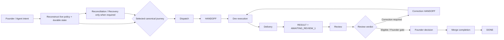
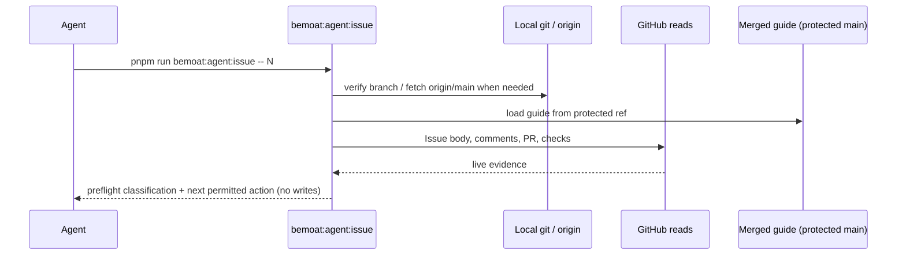
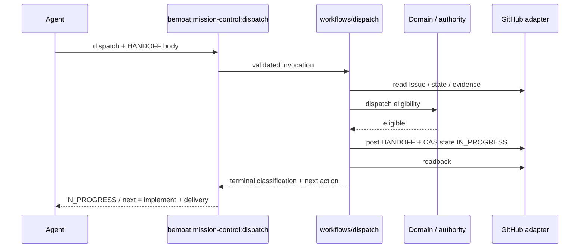
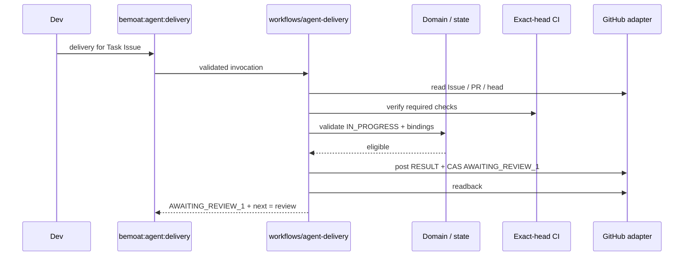
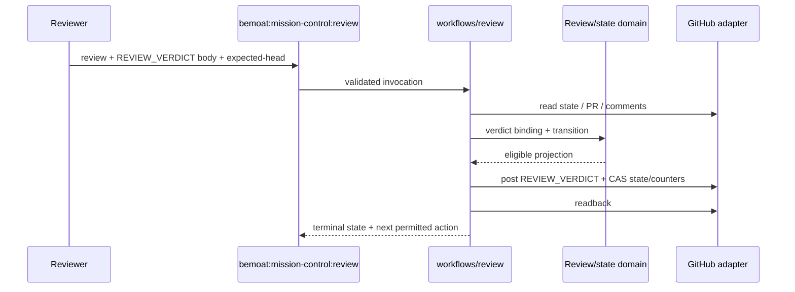
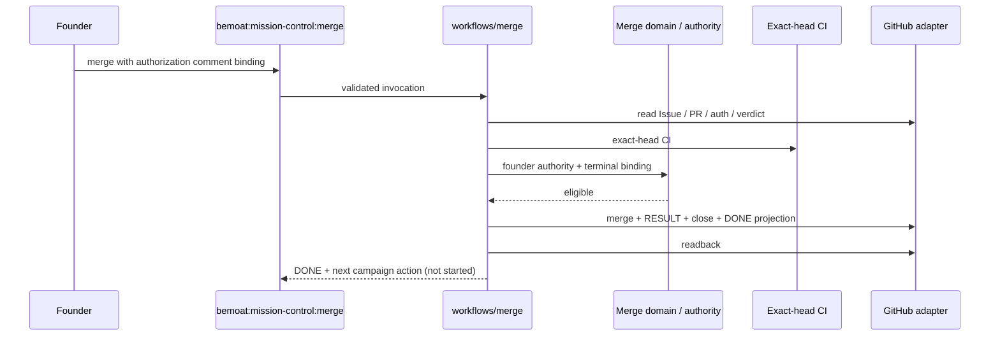
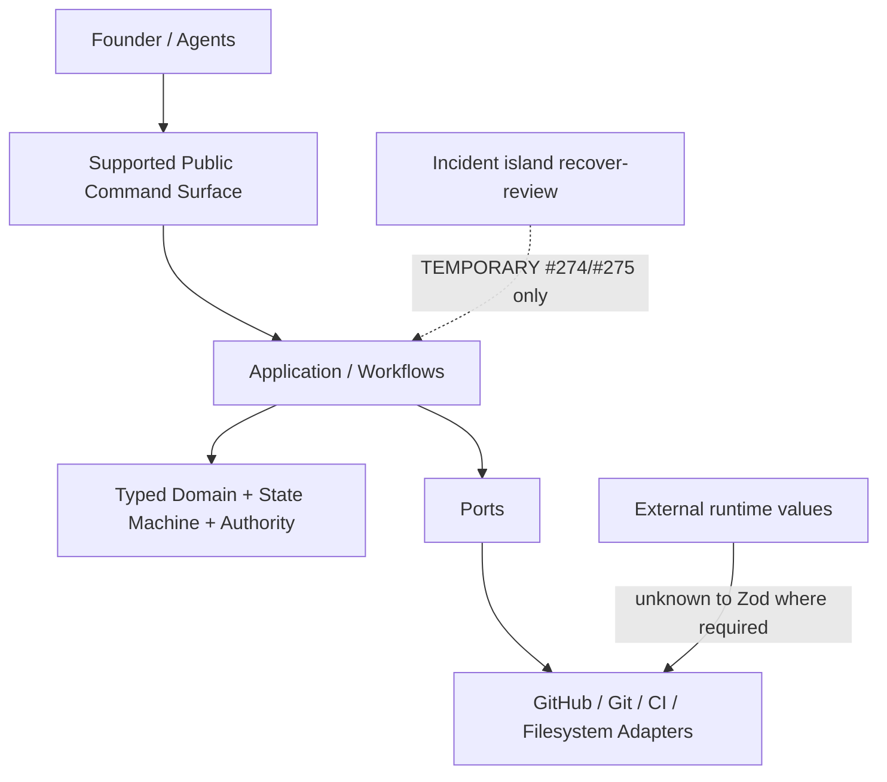

# Mission Control Architecture Design — Issue #340 (Correction)

**Status:** DESIGN CORRECTION for Founder review. **No target architecture is approved.**  
**Baseline (authoritative):** protected `main@7cfd62b6197a2e95fc8dbe06e30e047550b85e2b` (PR #339 Phase-1 merge).  
**Policy source (merged protected main only):** `docs/mission-control/mission-control-guide.md` v1.3.0, blob `fa3c75772ca85ad5ce6659fb1eff4958bdd0c3f9`.  
**Durable correction authority:** Issue #340 `REVIEW_VERDICT` comment `5296630734` (MC-340-DESIGN-001 … 006).  
**This document:** Superpowers design record only. It is **not** `architecture-blueprint.md` and must not be treated as normative architecture until Founder approves a target option and documentation implementation is separately authorized.

---

## 0. Authority and non-claims

| Claim | Status |
| --- | --- |
| Founder approved merging PR #339 as Phase-1 TS checkpoint | True (Issue #340 RESULT `5296499174`) |
| Founder approved any Issue #340 target architecture option | **False — none approved** |
| Option 1 / “Pristine Hub” is selected | **False — proposal only** |
| This design authorizes pruning, Batch 6, #333 closure, deploy, or production mutation | **False** |

Any prior draft wording that Option 1 was “Approved” or “Selected” was incorrect and is withdrawn (MC-340-DESIGN-001).

---

## 1. Design rule (journey-first)

Primary question (Founder amendment on #340):

> For each supported Mission Control case, what starts the journey, which canonical command is called, which validations and internal capabilities are required, what durable mutations occur, what failures are legitimate, and what exact terminal state / next permitted action ends the journey?

Retention requires at least one of:

1. participation in a supported canonical journey;
2. enforcement of a required invariant for one or more journeys;
3. real-world failure recovery still possible under correct canonical operation; or
4. an explicitly identified live temporary consumer.

Static reachability alone is insufficient for deletion authority.

---

## 2. High-level journey map

Normal-success paths and exceptional recovery paths remain visibly distinct.

---

## 3. Canonical Journey Atlas

Legend for **Target disposition:** `KEEP` / `MERGE` / `SPLIT` / `TEMPORARY` / `PRUNE` apply to *components implementing the journey*, not to Founder-approved pruning (none authorized yet).

### J1 — Repository / policy / durable-state reconstruction

| Field | Content |
| --- | --- |
| Purpose | Reconstruct authoritative policy + live durable Task state before any mutating journey |
| Trigger | Any agent/Founder operational start; local baseline mismatch; preflight |
| Actor | Any role (read-only); Mission Control policy loader |
| Canonical commands | `pnpm run bemoat:agent:issue -- <n>` (read-only preflight); policy load from protected `main` guide; raw GitHub reads permitted for verification |
| Ordered dependencies | Fetch/reverify `origin/main` → load guide from protected ref → parse managed-state markers → project comments/PR/CI evidence |
| Trust boundaries | Live GitHub is authoritative over stale local refs; guide blob/version from merged protected main; child override `.bemoat/mission-control-overrides.md` is child-owned and never managed |
| Durable reads | Issue body managed-state block; comments; PR head/base; CI; guide |
| Durable writes | **None** on this journey |
| State transition | None (classification / next-action only) |
| Idempotency | Purely observational |
| Legitimate failures | Stale local object DB (fetch required); missing/malformed state → stop or route to J8/J9; policy/override conflict |
| Historical bypass (unsupported) | Reconstructing transitions by reading/mimicking implementation source; manual YAML edits |
| Terminal / next | Deterministic next permitted canonical command |
| Implementing / protecting | `scripts/agent-issue.mjs`, `scripts/agent-issue/**`, `domain/task-state.*`, policy loader, `mission-control-contract` / `mission-control-drift` guards |
| Disposition | **KEEP** (CORE). Local-fetch recovery is operational procedure, not a separate mutating command |

### J2 — Task bootstrap / start

| Field | Content |
| --- | --- |
| Purpose | Create a managed Task with initial durable state (genesis), distinct from ordinary issue start |
| Trigger | Founder-authorized genesis only |
| Actor | Founder + protected GitHub Actions environment `mission-control-task-creation` |
| Canonical entrypoint | `gh workflow run mission-control-task-bootstrap.yml --repo boat1994/bemoat-web-starter --ref main -f founder_authorization_comment_id=<id>` |
| Related package command | `bemoat:mission-control:task-bootstrap` → `scripts/mission-control-task-create.mjs` (implementation used by workflow; **not** a general agent Issue-creation API) |
| Preconditions | Immutable Founder authorization comment; protected workflow; signing secrets; caller cannot supply PR/Issue body/state |
| Durable writes | New Issue with initial managed state (`AWAITING_REVIEW_1`, counters 0/0), attestation, ownership-registry record |
| Legitimate failures | CAS/lease, missing CI, wrong keys, ambiguous API → fail-closed; identical request recovers same provisional Issue |
| Historical bypass | Ad-hoc `gh issue create` + manual state YAML |
| Terminal / next | Managed Task ready for review/dispatch per projected state |
| Disposition | **KEEP** as **PLATFORM / exceptional genesis** (not ordinary agent start). Ordinary “start work” is **J3** |

**Ordinary task start (non-genesis):** after a managed Task exists, agents start via **J3 Dispatch**, preceded by **J1** preflight. `bemoat:agent:issue` does not create Tasks.

### J3 — Dispatch → HANDOFF

| Field | Content |
| --- | --- |
| Purpose | Claim work; post HANDOFF; move to `IN_PROGRESS` only |
| Trigger | Dispatchable managed state; agent ready to execute |
| Actor | Mission Control / Dev via dispatch transport |
| Canonical command | `pnpm run bemoat:mission-control:dispatch -- <issue> [--body-file HANDOFF] …` |
| Ordered calls | Parse invocation → read Issue/PR/policy → validate dispatchable state → post HANDOFF → CAS state → `IN_PROGRESS` |
| Trust boundaries | HANDOFF body structural contract; Founder-correction / planning-base flags when required; no `AWAITING_REVIEW_1` ownership |
| Durable reads | Managed state, auth comments when correction dispatch |
| Durable writes | HANDOFF comment; state → `IN_PROGRESS` |
| State transition | `READY` → `IN_PROGRESS` (and authorized correction re-entry paths per guide) |
| Idempotency / failures | Fail-closed on conflict; no ad-hoc `gh issue edit` |
| Terminal / next | Dev executes locally; next mutating journey is delivery (**J4**) or correction delivery |
| Implementing | `mission-control-dispatch.mjs`, `workflows/dispatch.mjs`, `managed-task-dispatch.mjs`, `founder-correction-dispatch.mjs`, adapters |
| Disposition | **KEEP** (CORE) |

### J4 — Delivery → RESULT → `AWAITING_REVIEW_1`

| Field | Content |
| --- | --- |
| Purpose | Promote successful implementation to first review gate |
| Trigger | Dev finishes focused change with PR/CI evidence |
| Actor | Dev (Delivery Coordinator) |
| Canonical command | `pnpm run bemoat:agent:delivery` |
| Ordered calls | Preflight → verify PR/head/CI/branch → post RESULT → transition to `AWAITING_REVIEW_1` |
| Trust boundaries | Exact head; CI green where required; single PR binding; branch guardrails |
| Durable writes | RESULT comment; state `IN_PROGRESS` → `AWAITING_REVIEW_1` |
| Legitimate failures | CI fail (`BLOCKED_EXTERNAL`), state mismatch (`STATE_CONFLICT`) → stop; route to **J8** only for routing repair, not to invent review |
| Historical bypass | Manual state edit to `AWAITING_REVIEW_1`; posting RESULT without delivery command |
| Terminal / next | Review (**J5**) |
| Implementing | `scripts/agent-delivery.mjs`, `workflows/agent-delivery.mjs` |
| Disposition | **KEEP** (CORE) |

### J5 — Review → `REVIEW_VERDICT`

| Field | Content |
| --- | --- |
| Purpose | Full Review 1 or later full/delta review; advance counters/state |
| Trigger | `AWAITING_REVIEW_N` with exact head |
| Actor | Reviewer |
| Canonical command | `pnpm run bemoat:mission-control:review -- <issue> --body-file <verdict> --expected-state … --review-type full\|delta --expected-head <sha>` |
| Ordered calls | Parse verdict → bind PR/base/head → authority/state machine → post `REVIEW_VERDICT` → project counters/state |
| Durable writes | `REVIEW_VERDICT`; state to `CORRECTION_REQUIRED_*` / `ELIGIBLE_FOR_FOUNDER_REVIEW` / founder-decision states per guide |
| Exact-head / CI | Required as documented for the review type |
| Legitimate failures | Invalid verdict shape, head drift, noncanonical role evidence → fail-closed |
| **Not** recovery | Do **not** use `recover-review` for ordinary review failure (**J9a** is incident-specific) |
| Terminal / next | Correction (**J6**), Founder merge (**J7**), or founder-decision path |
| Disposition | **KEEP** (CORE) |

### J6 — Correction → bounded Delta Review

| Field | Content |
| --- | --- |
| Purpose | Fix review findings under active correction contract; return to review |
| Trigger | `CORRECTION_REQUIRED_1\|2` (or founder-authorized correction path) |
| Actor | Dev; optional Founder `adopt-finding` |
| Canonical commands | Preflight: `bemoat:agent:issue -- <n> --phase correction`; Dispatch correction HANDOFF: `bemoat:mission-control:dispatch` (founder-correction when required); implement; `bemoat:agent:delivery` → `AWAITING_REVIEW_2\|3`; Reviewer: `bemoat:mission-control:review --review-type delta` |
| Optional | `bemoat:mission-control:adopt-finding` appends exactly one Founder-authorized finding without changing `CORRECTION_REQUIRED` or counters |
| Trust boundaries | Active correction contract fingerprint; predecessor verdict lineage; no Review-4 without Founder gate |
| Durable writes | Correction HANDOFF/RESULT; optional adopt-finding RESULT; delta `REVIEW_VERDICT` |
| Historical bypass | Manual counter edits; treating Minor as blocker without policy |
| Terminal / next | Further correction, eligibility, or founder decision |
| Disposition | **KEEP** (CORE). `adopt-finding` **KEEP** (CORE / authority) |

### J7 — Founder merge → `DONE`

| Field | Content |
| --- | --- |
| Purpose | Founder-authorized merge-completion bundle → terminal `DONE` |
| Trigger | `ELIGIBLE_FOR_FOUNDER_REVIEW` + immutable Founder merge authorization JSON comment |
| Actor | Founder (allowlist `BEMOAT_FOUNDER_LOGINS`) |
| Canonical command | `pnpm run bemoat:mission-control:merge` |
| Ordered calls | Verify auth/verdict/head/base/CI/mergeability → merge with expected-head → post final RESULT → close Issue → write `DONE` → campaign slice projection → select next campaign action **without starting it** |
| Trust boundaries | Auth comment author allowlist; exact reviewed head == live head; policy identity |
| Idempotency | Already merged+closed+`DONE` → `NO_OP` after evidence verify |
| Legitimate failures | Missing auth, head drift, CI, CAS → stop; **J8** only for routing repair |
| Historical bypass | Merging without merge command; agents closing issues |
| Terminal / next | Campaign next-action selection (not auto-start) |
| Disposition | **KEEP** (CORE) |

### J8 — Deterministic reconciliation

| Field | Content |
| --- | --- |
| Purpose | Repair **routing-only** projection drift when managed state exists |
| Trigger | Proven routing mismatch after partial failure / ambiguous projection |
| Actor | Mission Control |
| Canonical command | `pnpm run bemoat:mission-control:reconcile -- <issue>` |
| Preconditions | Existing valid managed-state block |
| **Cannot** | Initialize state; replay reviews; post verdicts; increment counters |
| Durable writes | Routing/lineage repair only, preserving domain state/counters/PR/head/RESULT/verdict bindings |
| Terminal / next | Re-enter the journey indicated by repaired routing |
| Disposition | **KEEP** (SAFETY / real-world recovery under canonical operation) |

### J9 — Real-world recovery (generic vs incident)

#### J9a — `recover-review` (**INCIDENT_SPECIFIC**)

| Field | Content |
| --- | --- |
| Purpose | Quarantine **only** the approved Issue **#274** / PR **#275** raw-review incident |
| Live consumer (verified 2026-08-15) | Issue #274 **OPEN**; PR #275 **OPEN** (mergeable: CONFLICTING) |
| Canonical command | `pnpm run bemoat:mission-control:recover-review` (pinned args per command-reference) |
| Classification | **`INCIDENT_SPECIFIC` / TEMPORARY** until #274/#275 separately resolved or Founder changes architecture |
| Explicit non-claim | **Not** a generic review recovery API; **not** ordinary substitute for `review` or `reconcile` |
| Disposition | **TEMPORARY KEEP** while live; do not port as generic capability; do not delete solely from static reachability |

#### J9b — `recover-state` (exceptional real-world recovery)

| Field | Content |
| --- | --- |
| Purpose | Recreate **one wholly absent** managed-state block from uniquely reconstructable immutable evidence |
| Canonical command | `pnpm run bemoat:mission-control:recover-state` |
| **Cannot** | Repair malformed state; replay review; invoke adopt-finding automatically |
| Success next | Already-authorized `adopt-finding` after fresh verification |
| Disposition | **KEEP** as exceptional recovery (distinct from J9a and from historical agent-bypass compatibility) |

#### J9c — `reopen` (Founder-authorized head-drift correction path)

| Field | Content |
| --- | --- |
| Purpose | Project Founder-authorized PR head drift to `FOUNDER_AUTHORIZED_CORRECTION` |
| Canonical command | `pnpm run bemoat:mission-control:reopen` |
| Disposition | **KEEP** (CORE / Founder authority). Related to correction re-entry, not generic recovery |

### J10 — Canonical role-comment publication / readback

| Field | Content |
| --- | --- |
| Purpose | Validate and post `HANDOFF` / `RESULT` / `REVIEW_VERDICT` with readback |
| Canonical command | `pnpm run bemoat:issue:comment` → `scripts/post-role-comment.mjs` |
| Also used by | Domain workflows that post role comments as part of J3–J7 |
| Active dependency | `workflows/post-role-comment.mjs` imports `diagnostics/github-comment-projection.mjs` (also used by `agent-issue` evidence) |
| Disposition | **KEEP** publication path (CORE). `github-comment-projection.mjs` **KEEP until consumer closed / consolidated** — **not** orphaned |

### J11 — Child / harness sync disposition

| Field | Content |
| --- | --- |
| Purpose | Propagate starter-managed harness (including MC policy/docs/guards wrappers) to children |
| Canonical commands | `pnpm run bemoat:boilerplate:check\|sync -- --harness-only` (or `--full`) |
| Ownership | **Platform / harness-sync**, documented in `docs/harness-sync-contract.md`; Mission Control **policy files** are managed paths, but sync **execution** is not a Mission Control state-machine journey |
| Target disposition | **SPLIT ownership in blueprint:** treat as **PLATFORM** capability that MC policy depends on, not as an MC lifecycle journey. Retain commands; do not fold sync into MC workflows |
| Atlas decision | **Supported as PLATFORM journey adjacent to MC; not merged into J1–J10** |

---

## 4. CURRENT AS-BUILT evidence map

Evidence root: `main@7cfd62b6197a2e95fc8dbe06e30e047550b85e2b`.

### 4.1 Public command surface (package.json / registry)

| Command | Entrypoint | Role |
| --- | --- | --- |
| `bemoat:agent:issue` | `scripts/agent-issue.mjs` | Read-only reconstruction / preflight (J1) |
| `bemoat:agent:delivery` | `scripts/agent-delivery.mjs` | Delivery (J4) |
| `bemoat:mission-control:dispatch` | `scripts/mission-control-dispatch.mjs` | Dispatch (J3) |
| `bemoat:mission-control:review` | `scripts/mission-control-review.mjs` | Review (J5/J6) |
| `bemoat:mission-control:merge` | `scripts/mission-control-merge.mjs` | Merge (J7) |
| `bemoat:mission-control:reconcile` | `scripts/mission-control-reconcile.mjs` | Reconcile (J8) |
| `bemoat:mission-control:recover-review` | `scripts/mission-control-recover-review.mjs` | **INCIDENT_SPECIFIC** J9a |
| `bemoat:mission-control:recover-state` | `scripts/mission-control-recover-state.mjs` | J9b |
| `bemoat:mission-control:reopen` | `scripts/mission-control-reopen.mjs` | J9c |
| `bemoat:mission-control:adopt-finding` | `scripts/mission-control-adopt-finding.mjs` | J6 optional |
| `bemoat:mission-control:task-bootstrap` | `scripts/mission-control-task-create.mjs` | J2 implementation surface |
| `bemoat:issue:comment` | `scripts/post-role-comment.mjs` | J10 |
| `bemoat:boilerplate:check\|sync` | boilerplate scripts | J11 PLATFORM |
| `bemoat:guard:*` / `bemoat:check` / `bemoat:test:int` / `bemoat:typecheck` / `bemoat:branch:check` / `bemoat:hooks:install` | safety/platform | Guards & validation |

Unsupported agent behavior (explicit): reconstructing lifecycle by reading implementation source; ad-hoc managed-state mutation; replacing canonical commands with raw `gh issue edit`.

### 4.2 Workflows

| Workflow | Role |
| --- | --- |
| `.github/workflows/mission-control-task-bootstrap.yml` | Genesis J2 |
| `.github/workflows/ci.yml` | Exact-head CI consumer for delivery/review/merge |
| `.github/workflows/ci-starter.yml` | Starter-strict CI |

### 4.3 Domain / state / authority ownership

| Concern | Owner (as-built) |
| --- | --- |
| Managed Task state parse/render | `domain/task-state.*` (+ authorization helper) |
| Review verdict projection/transition | `review-verdict-*.mjs/.ts`, `workflows/review.mjs` |
| Merge authority / terminal bundle | `domain/merge-*.ts`, `workflows/merge.mjs`, Founder allowlist |
| Campaign parse/validate/normalize | `domain/campaign-*.ts` (Zod boundary in validator) |
| Correction contract | `domain/correction-contract*`, `active-correction-contract*` |
| Dispatch | `workflows/dispatch.mjs`, `managed-task-dispatch.mjs` |
| Reconciliation analysis | `bounded-reconciliation.mjs`, `reconciliation-*.mjs`, `workflows/reconcile.mjs` |
| Recover-review / recover-state | dedicated workflows + adapters + domain evidence modules |

Durable SoT: Issue managed-state markers + immutable role comments + PR head/CI; Founder auth comments for merge/reopen/adoption/recovery.

### 4.4 Adapters

`scripts/mission-control/adapters/*` — GitHub/git transports for merge, recover-review, recover-state, reopen, task-bootstrap, adopt-finding, shared github/git transport.

### 4.5 Runtime trust / Zod boundaries

| Boundary | As-built |
| --- | --- |
| CLI invocation / help / result envelopes | `scripts/cli/command-*-schemas.ts` + Zod |
| Campaign external evidence | `campaign-validator-boundary.ts` / schemas (Zod `safeParse`) |
| Native TS execution | Node type-stripping; `docs/mission-control/typescript-runtime-contract.md`; `bemoat:typecheck` |
| Remaining `.mjs` production | Still authoritative for many workflows/entrypoints |

Principle: unknown external runtime values → Zod (or equivalent fail-closed parse) at adapter/CLI boundary; domain prefers typed modules.

### 4.6 Reconciliation / recovery (corrected)

| Mechanism | Class |
| --- | --- |
| `reconcile` | Real-world routing repair (KEEP) |
| `recover-state` | Exceptional absent-state reconstruction (KEEP) |
| `recover-review` | **INCIDENT_SPECIFIC** #274/#275 only (TEMPORARY) |
| `reopen` | Founder-authorized correction path (KEEP) |
| Agent-bypass compatibility shims | Candidates for semantic simplification **after** Founder approval — not “recovery” |

### 4.7 Compatibility facades (evidence-backed)

| Path | Evidence | Tentative class |
| --- | --- | --- |
| `domain/brainstorming.mjs` | `export * from './brainstorming.ts'`; tests import `.mjs` | Low-risk facade cleanup candidate |
| `domain/task-state-authorization.mjs` | re-export; boundary test references path | Low-risk facade cleanup candidate |
| `domain/merge-head-bindings.mjs` | re-export; production merge imports `.ts`; tests exercise facade | Low-risk facade cleanup candidate |
| `workflows/campaign-projection.mjs` | dry-run helper; imported by tests | Investigate / possibly KEEP as workflow helper (not dead) |
| `diagnostics/github-comment-projection.mjs` | **Live imports** from `post-role-comment` + `agent-issue` | **KEEP** (active) |

Inventory counts on baseline: **87** `scripts/mission-control/**/*.mjs`, **68** `*.ts`; of `.mjs`, ~**34** paired re-export facades and ~**53** mjs-only implementation files (mechanical pair scan).

### 4.8 Tests / protected oracles

| Item | Evidence |
| --- | --- |
| Protected oracles (SHA-256) | 3 files in `scripts/structural-protection-manifest.json`: adopt-finding, merge, merge-verdict-binding int specs |
| Grandfathered line ceilings | 26 production script entries |
| Int suite | `pnpm run bemoat:test:int` / vitest; broad `tests/int/mission-control-*.int.spec.ts` |

### 4.9 Guard / protection ownership

Central pack: `scripts/guards/pack.mjs` via `bemoat:guard:safety` / `bemoat:guard:pack`. Exact **13** guard IDs audited in §5. Root facades: `scripts/guard-pack.mjs`, `guard-harness-contract.mjs`, `guard-mission-control-contract.mjs`, `guard-cloudflare-env.mjs`.

### 4.10 Live temporary consumers

| Consumer | Live state | Implication |
| --- | --- | --- |
| Issue #274 / PR #275 | OPEN / OPEN | Pins `recover-review` as TEMPORARY |
| Issue #333 | OPEN; Batch 6 not started | Migration frozen pending #340 Founder architecture decision |

---

## 5. Guard-pack audit (exact 13 IDs)

Source: `GUARD_PACK` in `scripts/guards/pack.mjs` on protected main. **Do not substitute** helper filenames or the aggregator for these IDs.

| # | Guard ID | Implementation note | Journey / invariant | Remains under canonical usage? | Authoritative layer today | Defense-in-depth vs duplicate SoT | Disposition (proposal) |
| --- | --- | --- | --- | --- | --- | --- | --- |
| 1 | `repo-safety` | `guards/repo-safety.mjs` | PLATFORM safety for all journeys shipping code | Yes (secrets/SQL) | Guard + human approval marker | Independent safety | **RETAIN** (PLATFORM/SAFETY) |
| 2 | `harness-contract` | `scripts/guard-harness-contract.mjs` | Child harness must call `bemoat:*` (J11) | Yes | Guard + sync contract | Deliberate child-facing depth | **RETAIN** (PLATFORM) |
| 3 | `build-script-contract` | `guards/build-script-contract.mjs` | OpenNext vs Next build separation | Yes for Cloudflare apps | Guard | Platform contract; includes `cf:build` alias rules | **RETAIN** platform; alias subset may be **semantic-simplification candidate** after Founder decision — not “dead” |
| 4 | `package-manager` | `guards/package-manager.mjs` | pnpm-only invariant | Yes | Guard | Independent | **RETAIN** |
| 5 | `toolchain-contract` | `guards/toolchain-contract.mjs` | Node/TS/lock/harness compiler contract | Yes (J1 tools, TS migration) | Guard + `.bemoat/toolchain-contract.json` | Depth with typecheck | **RETAIN** |
| 6 | `env-placeholder` | `guards/env-placeholder.mjs` | `.env.example` safety | Yes | Guard | Independent | **RETAIN** |
| 7 | `cloudflare-config` | **pack id**; file `guards/cloudflare-env.mjs` / `guard-cloudflare-env.mjs` | wrangler isolation / no `env.production` | Yes | Guard | Independent | **RETAIN** (name must stay `cloudflare-config` in audits) |
| 8 | `frontend-seo` | `guards/frontend-seo.mjs` | Frontend metadata baseline | Product invariant, not MC lifecycle | Guard | Not MC SoT | **RETAIN as PLATFORM** or **SPLIT out of “MC lean pack”** in target options — still active; not omit from census |
| 9 | `mission-control-contract` | `guard-mission-control-contract.mjs` + `guards/mission-control-contract/**` | Guide/loader/templates/sync/review invariants (MC001–MC012) | Yes | Guard + guide | Some textual rules may be **rule-level simplify** later | **RETAIN**; audit rules individually in pruning phase |
| 10 | `planning-contract` | **pack id**; runtime `planning-contract-runtime.mjs` (+ `planning-contract.mjs` helpers) | Superpowers task-identity for planning journeys | Yes when planning docs change | Guard + live gh checks | Depth with MC state parse | **RETAIN** |
| 11 | `mission-control-drift` | `guards/mission-control-drift.mjs` | State/review matrices vs domain parse/render/reconcile | Yes | Guard matrices + domain | **Deliberate defense-in-depth**; candidate to merge into typed-domain/tests under some options | **RETAIN now**; option-dependent **MERGE** later |
| 12 | `structural-protection` | `guards/structural-protection.mjs` + manifest | (a) protected-oracle SHA-256 (b) line-count ceilings / grandfathering | (a) Yes (b) migration ratchet | Guard + Founder-gated manifest | **SPLIT concerns** in target blueprint | **RETAIN**; **SPLIT** oracle integrity vs line-count ratchet in options |
| 13 | `scripts-architecture` | `guards/scripts-architecture.mjs` + `architecture-contract.json` | Dependency direction vs contract | Yes | Guard + JSON contract | Rebaseline to **approved** blueprint later | **RETAIN concept**; **rebaseline** after Founder architecture approval |

Aggregator `pack.mjs` is **not** one of the 13 IDs.

---

## 6. Pruning / simplification classes (explicit separation)

| Class | Meaning | Examples (candidates only) |
| --- | --- | --- |
| **A. Low-risk dead/facade cleanup** | Remove or collapse re-export-only `.mjs` after importers/tests updated; no semantic change | `brainstorming.mjs`, `task-state-authorization.mjs`, `merge-head-bindings.mjs` (re-verify at prune time) |
| **B. Intentional semantic simplification** | Retire bypass-tolerance or duplicate SoT **after** Founder approves target option | Historical agent-bypass compatibility; optional merge of drift matrices into typed tests; shrinking textual MC contract rules |
| **C. Temporary incident-specific** | Keep until live consumer closed | `recover-review` + #274/#275 |
| **D. Permanent real-world recovery** | Keep under correct canonical operation | `reconcile`, `recover-state`, CAS/lease retry, exact-head CI fail-closed, reopen |

No class authorizes deletion in this design phase.

---

## 7. TARGET LEAN ARCHITECTURE options (proposals only)

All options assume journey-first Atlas in §3, preserve Founder authority / exact-head / CAS / fail-closed, and keep J9a until #274/#275 resolved unless Founder directs otherwise.

### Option A — Journey Hub + thin compatibility

- **Supported journeys:** J1–J11 as dispositioned (J11 PLATFORM-adjacent).
- **Public command surface:** Keep current `bemoat:*` MC commands; collapse only proven re-export facades (Class A).
- **Recovery posture:** Keep J8 + J9b + J9c; J9a TEMPORARY.
- **Compatibility posture:** Minimal facades during TS migration; no broad bypass tolerance removal yet.
- **Guard strategy:** Retain all 13; document SPLIT for `structural-protection`; rule-audit `mission-control-contract` later.
- **TS/Zod ownership:** Continue slice migration on surviving workflows/domain; Zod at CLI/adapter/campaign boundaries.
- **Pruning impact:** Low (Class A only until second Founder gate).
- **Estimated surviving TS migration surface:** ~**50–55** mjs-only MC implementation files + workflow/adapter ports; facades not counted as semantic ports. Order-of-magnitude **unchanged** from current remaining mjs-only set.
- **Risks:** Leaves more historical complexity in place longer; slower simplification.

### Option B — Pristine Journey Hub (aggressive lean) — `RECOMMENDED — NOT APPROVED`

- **Supported journeys:** Same Atlas; explicitly refuse unsupported mimicry paths.
- **Public command surface:** Canonical commands only; remove Class A facades; after separate Founder prune auth, remove bypass-only compatibility (Class B) that has no live consumer.
- **Recovery posture:** Identical to A for J8/J9b/J9c; J9a remains INCIDENT_SPECIFIC until consumer closed — **not** promoted to generic API.
- **Compatibility posture:** Least tolerance for agent-bypass; fail closed on non-canonical entry.
- **Guard strategy:** Retain PLATFORM guards (1–8, 10); keep MC contract + drift initially; **SPLIT** structural-protection (keep oracle hashes; rebaseline/retire line-count ratchet after #328 goals satisfied); **rebaseline** `scripts-architecture` to approved blueprint; optionally move some drift matrices into typed-domain oracles (MERGE) once TS owns matrices.
- **TS/Zod ownership:** Port only journey-justified modules; do not TS-port prune candidates.
- **Pruning impact:** Medium–high after Founder prune authorization; largest reduction in duplicate SoT and facades.
- **Estimated surviving TS migration surface:** ~**35–45** semantic MC files after Class A + evidence-backed Class B prune (excludes TEMPORARY incident modules until retired).
- **Risks:** Over-pruning if live consumers missed; requires strict live-GitHub checks per deletion; higher short-term breakage for any out-of-contract agent habits.
- **Label:** **`RECOMMENDED — NOT APPROVED`** (recommendation ≠ selection).

### Option C — Dual-track: freeze incident island, lean the core

- **Supported journeys:** Core J1–J8, J9b, J9c, J10; quarantine J9a (+ adapters/tests) as an **incident island** with explicit isolation boundary; J11 PLATFORM.
- **Public command surface:** Same as A for core; incident command retained but documented as non-core.
- **Recovery posture:** Core permanent recovery only in main diagram; incident transport outside lean core.
- **Compatibility posture:** Class A cleanup in core; Class B only inside core after approval; incident island untouched until #274/#275 done.
- **Guard strategy:** Same as A/B for pack; architecture-contract may mark incident edges as allowed exceptions.
- **TS/Zod ownership:** Do **not** migrate incident island to TS until retirement or Founder redesign; focus TS on core journeys.
- **Pruning impact:** Medium for core; zero for island until consumer closes.
- **Estimated surviving TS migration surface:** ~**40–50** core files; incident modules deferred/out of migration count until retired.
- **Risks:** Two mental models; risk of accidental “genericizing” incident APIs; longer dual maintenance.

---

## 8. Findings resolution matrix (MC-340-DESIGN-001 … 006)

| ID | Finding | Resolution in this correction |
| --- | --- | --- |
| **001** | Fabricated Founder approval of Option 1 | Removed all approved/selected architecture claims; §0 + Option B labeled **`RECOMMENDED — NOT APPROVED`** |
| **002** | Incomplete Journey Atlas | §3 dispositions J1–J11 with required fields; major journeys include Mermaid sequences |
| **003** | Guard census ≠ live 13 | §5 audits exact pack IDs including `harness-contract`, `cloudflare-config`, `mission-control-contract`; no substitute IDs |
| **004** | `recover-review` misclassified | §3 J9a + §4.6: **INCIDENT_SPECIFIC** to #274/#275; distinct from generic recovery |
| **005** | Missing 2–3 options | §7 Options A/B/C with trade-offs; recommendation clearly not approval |
| **006** | Incomplete blueprint evidence | §4 as-built maps; §5 journey-linked guards; §6 class separation; TS surface estimates under options |

---

## 9. Self-review checklist (must pass before Founder re-review)

- [x] No claim that Founder approved a target architecture option
- [x] Journey Atlas covers reconstruction, bootstrap/start, dispatch, delivery, review, correction/delta, merge/DONE, reconcile, real-world recovery, role-comment, child/harness sync
- [x] Major journeys have sequence diagrams naming real commands
- [x] Exact 13 guard IDs audited
- [x] `recover-review` incident-specific with live #274/#275 evidence
- [x] Three viable options; recommendation marked **`RECOMMENDED — NOT APPROVED`**
- [x] Class A/B/C/D separated
- [x] No production MC code/guards modified in this correction
- [x] No Batch 6 / #333 closure / deploy authorization implied

---

## 10. Unresolved items requiring Founder decision

1. **Which target option** (A / B / C) becomes approved architecture (or a named variant)?
2. After option approval: authorize **documentation** implementation (`architecture-blueprint.md` Journey Atlas) separately from **pruning**.
3. Whether **`frontend-seo`** remains in the central pack vs platform-only optional pack.
4. Whether **`structural-protection` line-count ratchet** is retired/split after decomposition goals, while retaining oracle hashes.
5. When **#274/#275** close, whether to delete or redesign `recover-review` (default proposal: delete incident transport after consumer closed).
6. Sequencing of Class A facade cleanup vs Class B semantic simplification (recommend A first).

---

## 11. Stop condition

Corrected architecture **design** is ready for Founder review.  
**No pruning, no runtime changes, no Batch 6, no #333 closure.**
